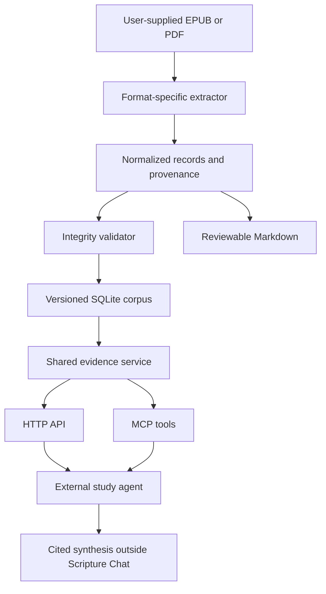
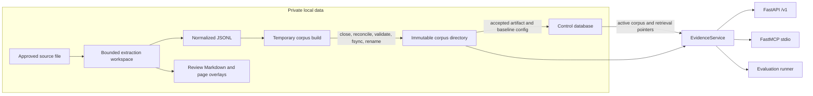
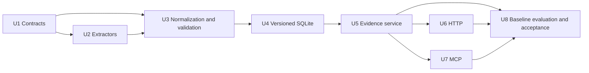

# Scripture Chat - Plan

## Goal Capsule

- **Objective:** Build a local-first Book of Mormon evidence database and agent-facing API that returns exact, inspectable citations from a user-supplied current Church edition.
- **Product authority:** The Product Contract controls corpus fidelity, provenance, retrieval behavior, and evidence semantics. The Planning Contract controls implementation shape. A supplied source file controls canonical text only after the maintainer approves its exact digest and acquisition record; documentation and fixtures never override approved source bytes.
- **Execution profile:** Greenfield Python service with a versioned SQLite corpus, deterministic ingestion, HTTP API, MCP tools, and a corpus-specific lexical/reference retrieval evaluation.
- **Stop conditions:** Do not accept a corpus with unresolved integrity errors, silently OCR an image-only PDF, promote a retrieval method that weakens citation integrity, expose the service beyond loopback without a separate security decision, or commit raw private source and repair content. A later maintainer decision permits exact inactive derived candidate snapshots under `candidates/`; that exception does not accept or activate them.
- **Tail ownership:** Implementation includes source-independent automated tests and a private-source acceptance run when the user supplies an EPUB or PDF. Absence of that file blocks corpus acceptance, not development of the importer and service; an unapproved source digest also blocks activation.

---

## Product Contract

### Summary

Scripture Chat will turn a user-supplied EPUB or text-layer PDF into a private, versioned Book of Mormon evidence corpus. A shared evidence service will expose canonical lookup, context, official-reference traversal, and evaluated retrieval through HTTP and MCP without generating doctrinal conclusions.

### Problem Frame

Manual reference-following in paper scriptures supports focused study, but it is laborious and bounded by links a reader notices or an editor supplied. Useful relationships can remain hidden across distant passages, variant terminology, narrative context, and indirect doctrinal parallels.

The project should reduce that research burden without replacing personal study or presenting model-generated interpretation as scripture. Its durable value is a faithful, inspectable evidence layer that different agents and future study surfaces can use.

### Key Decisions

- **Book of Mormon first** (session-settled: user-directed — chosen over importing the full standard works initially: one complete volume is enough to validate corpus fidelity and retrieval before expansion). The data model may anticipate later canonical volumes, but their content is not part of this plan.
- **Current Church edition as the canonical text** (session-settled: user-directed — chosen over a public-domain historical edition: the personal study experience should match the user's present scriptures). Corpus and derived indexes remain local and private.
- **Official footnotes and cross-references are first-class evidence** (session-settled: user-directed — chosen over text-and-structure-only ingestion: the existing reference network is essential for research and retrieval evaluation).
- **Progressive evidence platform** (session-settled: user-directed — chosen over canonical-search-only and knowledge-graph-first approaches: citation integrity remains foundational while richer retrieval methods are evaluated incrementally).
- **Evidence API, not a synthesis service** (session-settled: user-directed — chosen over built-in answer generation: the corpus should remain useful across language models, agent frameworks, and future interfaces).
- **Scripture-first authority layers** (session-settled: user-directed — chosen over mixing commentary into the initial corpus: official LDS sources and broader scholarship may be added later as separately attributed corpora).
- **Local-first personal use** (session-settled: user-directed — chosen over a private hosted or public API: the first release has no account, public-service, or redistribution requirement).
- **Citation integrity is the primary quality bar** (session-settled: user-directed — chosen over optimizing first for recall or novel relationships: every excerpt and relationship must remain resolvable to its source).

### Actors

- A1. **Researcher:** The project owner, who frames doctrinal questions and inspects the scriptural evidence an agent uses.
- A2. **External study agent:** A local or connected agent that queries the API, assembles an evidence trail, and may produce a cited synthesis outside Scripture Chat.
- A3. **Corpus maintainer:** The project owner acting in a maintenance role to supply, validate, rebuild, and update the local corpus.

### Requirements

**Canonical corpus and provenance**

- R1. The corpus must reproduce the selected current Church edition of the Book of Mormon without silently modernizing, correcting, or paraphrasing its text.
- R2. Every canonical passage must retain its book, chapter, verse, ordering, surrounding context, edition identity, and source provenance.
- R3. Official footnotes and cross-references must be source-attributed relationships that preserve origin and destination references; targets outside the Book of Mormon remain typed external citations without imported text.
- R4. The system must distinguish source content from derived metadata so an agent can tell what the edition states from what Scripture Chat inferred or indexed.
- R5. The complete local corpus and every derived research surface must be reproducible from versioned source inputs and provenance records.
- R6. Canonical text, official study apparatus, and derived indexes must remain local and private unless their acquisition and reuse constraints permit broader distribution.

**Evidence API**

- R7. The API must expose canonical passages, surrounding context, official reference relationships, and provenance in citation-ready records.
- R8. The API must provide deterministic primitives for exact text search, passage lookup, contextual reading, filtering, and official-reference traversal.
- R9. The API must support doctrine-oriented evidence discovery without presenting retrieved passages as a doctrinal conclusion.
- R10. Every retrieved item must identify its retrieval basis, such as a textual match, official reference path, semantic candidate, or derived relationship.
- R11. Retrieval methods must remain independently testable and replaceable so later research can improve discovery without changing canonical identity or citation behavior.
- R12. The API must be usable by external agents without requiring a particular language model, embedding provider, or agent framework.
- R13. Repeating the same query against the same corpus and retrieval configuration must produce a reproducible evidence trail.

**Quality and evaluation**

- R14. Corpus validation must require exact equality with a versioned text-free Book of Mormon structure manifest, reconcile every normalized passage and apparatus anchor to retained raw source spans, and detect mismatched references, altered canonical text, broken in-corpus links, and ambiguous provenance before acceptance; well-formed external citations are not broken links.
- R15. Versioned doctrine-tracing research cases must separate development from locked promotion cases, pool and blind-grade candidates from every compared retrieval configuration, and measure expected passages plus useful indirect connections without treating one interpretation as doctrinal truth.
- R16. A richer retrieval method must not become a default path unless an immutable report binds the full evaluation recipe, has complete candidate judgments, preserves citation integrity, and demonstrates value on the locked promotion cases.
- R17. Retrieval results must expose enough context for an agent or researcher to reject a superficially similar but irrelevant passage.

**Private source ingestion**

- R18. The importer must accept a user-supplied EPUB as the preferred source and a user-supplied text-layer PDF as a validated fallback, normalizing both into the same typed record contract while rejecting hostile archives, external entities, remote resources, and inputs that exceed configured extraction budgets.
- R19. PDF extraction must retain page and layout provenance; Markdown is a generated review surface rather than an ingestion contract.
- R20. A corpus update must build and validate an isolated version before atomic promotion so a failed import cannot leave mixed or stale canonical data.



### Key Flows

- F1. Canonical corpus acceptance
  - **Trigger:** A3 supplies or updates an approved Book of Mormon source file.
  - **Actors:** A3
  - **Steps:** The system fingerprints the source, extracts format-specific structure, normalizes canonical records, generates review artifacts, builds an isolated corpus version, validates it, and atomically promotes only a valid version.
  - **Outcome:** A versioned local corpus can be rebuilt and audited without relying on an opaque or partially updated index.
  - **Covered by:** R1-R6, R14, R18-R20
- F2. Doctrine evidence discovery
  - **Trigger:** A2 receives a doctrine question from A1.
  - **Actors:** A1, A2
  - **Steps:** The agent uses one or more research primitives, follows relevant official links, requests context for candidates, and retains the retrieval basis and provenance for each selected passage.
  - **Outcome:** The agent holds an inspectable evidence set suitable for a cited synthesis outside Scripture Chat.
  - **Covered by:** R7-R13, R15-R17
- F3. Citation inspection
  - **Trigger:** A1 or A2 checks a passage used as evidence.
  - **Actors:** A1, A2
  - **Steps:** The API resolves the canonical reference, returns exact text with surrounding context, identifies the edition and source, and shows any official or derived relationship used to discover it.
  - **Outcome:** The evidence can be verified independently of the agent's interpretation.
  - **Covered by:** R2-R4, R7, R10, R17
- F4. Retrieval method promotion
  - **Trigger:** A3 considers adding or changing a discovery method.
  - **Actors:** A3
  - **Steps:** The method runs against curated doctrine cases, its citation behavior and retrieval contribution are compared with existing methods, and it remains optional unless it adds defensible evidence without weakening integrity.
  - **Outcome:** Retrieval evolves through measured improvements rather than architecture fashion.
  - **Covered by:** R11, R13-R17

### Acceptance Examples

- AE1. **Covers R1-R4, R7, R14.** Given a canonical reference in the imported Book of Mormon, when the API returns that passage, then its text, location, edition, provenance, and context match the accepted source exactly.
- AE2. **Covers R3, R7-R8, R10.** Given an official footnote or cross-reference, when an agent traverses it, then the API returns the origin and a typed destination; an out-of-corpus destination is labeled external and contains no fabricated local text.
- AE3. **Covers R4, R9-R10.** Given an indirectly related passage with no direct official cross-reference, when a discovery method returns it, then the result is labeled derived evidence and never represented as an official link or canonical doctrinal claim.
- AE4. **Covers R9, R17.** Given a doctrine query with only weakly related passages, when the API searches for evidence, then it returns inspectable candidates or an empty result rather than manufacturing a doctrinal answer.
- AE5. **Covers R11-R13.** Given two different external agents and the same corpus version and retrieval configuration, when they issue the same research operations, then each obtains the same ordered citation-ready evidence without provider-specific behavior from Scripture Chat.
- AE6. **Covers R14-R16.** Given a proposed retrieval method that improves apparent recall on development cases but produces unresolved citations, incomplete candidate judgments, or no improvement on the locked promotion set, when it is evaluated, then it is not eligible for the default research path.
- AE7. **Covers R5-R6, R14.** Given a clean local environment and a maintainer-approved private source digest, when A3 rebuilds the corpus, then accepted canonical records and official relationships pass exact structure, source-span, and persistence reconciliation without redistributed corpus artifacts.
- AE8. **Covers R18-R19.** Given equivalent synthetic EPUB and text-layer PDF fixtures, when each is imported, then both produce the same canonical references and text while retaining format-specific source locations.
- AE9. **Covers R20.** Given an accepted corpus and a replacement import with a missing passage or broken in-corpus edge, when validation fails, then the prior corpus remains active and no replacement rows or indexes become visible.

### Success Criteria

- The accepted corpus exactly matches the text-free structural manifest and has no known missing, duplicated, altered, or ambiguously identified Book of Mormon passages relative to the approved supplied source.
- Every accepted passage and apparatus anchor reconciles to retained raw source spans; a PDF-only corpus also passes exhaustive token/anchor overlay reconciliation.
- Every official relationship resolves to a valid in-corpus passage or a well-formed typed external citation.
- Every API evidence record traces to canonical source content or an explicitly labeled derived relationship.
- Equivalent EPUB and PDF fixtures normalize to the same canonical records, excluding format-specific provenance.
- The curated doctrine cases establish a repeatable lexical and official-reference baseline before any dense or fused retrieval implementation is approved.
- Any future richer method becomes default only through a report bound to the locked cases, judgments, evaluator code, corpus, and configuration, with zero citation-integrity failures and demonstrated retrieval contribution.
- HTTP and MCP return equivalent evidence records for the same service operation.
- At least one external agent consumes the private evidence API and produces a cited doctrine synthesis whose citations the maintainer resolves to the approved supplied source.

### Scope Boundaries

**Deferred for later**

- The Bible, Doctrine and Covenants, Pearl of Great Price, and edition-to-edition comparison.
- Official LDS study resources beyond the canonical scripture apparatus.
- Broad historical, linguistic, and academic scholarship as separately attributed corpora.
- Curated doctrine ontologies, entity graphs, claim graphs, GraphRAG, and other manually interpreted relationship layers.
- OCR for scanned or image-only PDFs; this release fails closed when no trustworthy text layer exists.
- A chat interface, printable study packets, visual research tools, and other end-user study surfaces.
- Private hosting, synchronization across devices, multi-user access, or a public API.

**Outside this product's identity**

- Scraping or automatically downloading content from the Church website without written permission.
- Declaring one generated doctrinal interpretation authoritative.
- Blending scripture, official commentary, and external scholarship without visible source boundaries.
- Replacing disconnected personal scripture study with an always-online assistant.
- Redistributing protected source text or study apparatus without verified permission.

### Dependencies and Assumptions

- The user will supply an official EPUB or text-layer PDF and approve its exact digest and acquisition record for the private-corpus acceptance run; synthetic fixtures support development before that file is available.
- The supplied edition contains enough embedded structure or visual regularity to identify books, chapters, verses, footnotes, and references without OCR.
- The researcher will curate doctrine questions and graded expected evidence from real scripture study; these judgments evaluate retrieval usefulness rather than doctrinal truth.
- Source content and all derived databases, review artifacts, and evaluation sets that quote it remain in gitignored local storage.

---

## Planning Contract

### Key Technical Decisions

- KTD1. **Use Python 3.12+, `uv`, and a `src/` package layout.** Python has the strongest fit for EPUB/PDF parsing, retrieval evaluation, FastAPI, and the official MCP SDK. The lockfile is committed; private data is not.
- KTD2. **Use user-supplied EPUB with PDF fallback** (session-settled: user-directed — chosen over EPUB-only or PDF-only ingestion: EPUB preserves structure best while PDF ensures the user's available edition remains usable). Each format has its own extractor and shares no format assumptions downstream.
- KTD3. **Normalize directly to typed JSONL records and derive Markdown for review** (session-settled: user-approved — chosen over PDF-to-Markdown-to-JSON ingestion: Markdown would discard layout and anchor provenance needed to validate citations). JSONL is deterministic, diffable, streamable, and never treated as canonical until validation succeeds.
- KTD4. **Build immutable corpus artifacts and promote through a control store** (session-settled: user-approved — chosen over row-level upserts: partial upserts can retain stale passages, footnotes, and search rows). Each attempt builds on the same filesystem as the private corpus root, closes and validates a complete SQLite file, fsyncs the file and manifest, atomically renames the version directory, fsyncs the containing directories, then commits the active corpus and that corpus's baseline retrieval configuration in one control-database transaction. Startup fails closed when either target is missing, corrupt, incompatible, or not accepted; rollback explicitly repoints to a revalidated compatible artifact and its baseline configuration.
- KTD5. **Separate canonical references from four build identities.** A reference such as `bofm/1-ne/3/7` remains stable across rebuilds. A maintainer-approved source SHA-256 and acquisition record establish which supplied bytes may become canonical; recipe fingerprint, normalized-record digest, and final artifact digest separately identify parser/profile/schema/importer behavior, canonical output, and persisted bytes. A digest detects later byte changes but does not independently authenticate an edition. Repeated declared identities must prove equivalence; divergent normalized output is quarantined as nondeterminism.
- KTD6. **Use immutable SQLite corpus files with explicit SQL schema initialization and FTS5, not an ORM or vector extension.** Each file owns canonical rows and its external-content FTS5 index; the FTS rowid is the immutable passage primary key. Content and FTS populate on one connection, then foreign-key, SQLite, FTS integrity, bidirectional row reconciliation, and exhaustive row-to-normalized-record hash reconciliation run before acceptance. Corpus schema changes rebuild a new file from normalized records; accepted files are never migrated in place. The first-release control database initializes schema v1 directly; generic migration and backup machinery begins with the first real version transition.
- KTD7. **Defer dense and fused retrieval until the baseline justifies them.** The first release implements exact lookup, FTS5/BM25, contextual windows, and official traversal only. A baseline evaluation report must expose a concrete recall gap before a later plan may add model acquisition, embedding execution, semantic artifact trust, or fusion.
- KTD8. **Evaluate retrieval with independent judgments and immutable recipe identity.** Development cases may guide tuning; locked promotion cases may not. Reports bind case definitions, relevance grades, curator annotations, evaluator code, metric depths, corpus, and retrieval configuration. Candidate pooling and blind grading occur before metrics, unresolved judgment coverage blocks eligibility, and evaluation never changes defaults. Any future richer configuration requires a separately implemented explicit selection action against a matching eligible report.
- KTD9. **Expose one explicit operation contract through FastAPI and MCP** (session-settled: user-directed — chosen over HTTP-only or MCP-only delivery: scripts and agents need different transports but identical evidence semantics). HTTP and MCP share the request models, response models, enumerations, defaults, hard bounds, continuation rules, domain-error codes, and service implementation defined below. Protocol envelopes differ; adapters may not invent aliases or behavior.
- KTD10. **Represent out-of-corpus official references as external citation targets.** Bible, Doctrine and Covenants, and Pearl of Great Price links retain normalized work, book, chapter, verse, label, and source attribution while resolving no local text.
- KTD11. **Fail closed on source ambiguity.** Unknown EPUB structures, PDFs without a usable text layer, duplicate canonical references, unparsed apparatus anchors, and ambiguous reading order produce validation errors rather than guessed text.
- KTD12. **Bind the HTTP service to loopback and provide MCP over stdio.** Authentication and remote exposure are outside scope. Every non-loopback bind is a hard configuration error until a separate plan defines authentication, transport security, authorization, and distribution constraints. HTTP and MCP both fail initialization with `corpus_unavailable` when no valid active corpus exists.
- KTD13. **Pin one immutable corpus and retrieval configuration per operation.** Every accepted corpus owns an immutable baseline retrieval configuration. Corpus activation atomically selects that baseline; any future richer configuration must be selected against the same corpus. Each call snapshots both identifiers once and uses only version-specific read-only resources. Promotion affects new calls only. Multi-call agent workflows pass the initial identifiers explicitly to prevent a corpus change from splitting an evidence trail.

### High-Level Technical Design



**Canonical records**

- `BuildIdentity`: maintainer-approved source SHA-256 and acquisition record, source profile, edition and language, recipe fingerprint, normalized-record digest, and final artifact digest.
- `CorpusVersion`: build identity, source format, schema version, attempt state, acceptance timestamp, and immutable artifact path.
- `SourceSpan`: EPUB member plus fragment and range, or PDF page plus bounding box and extraction order; a record may retain multiple spans.
- `CanonicalReference`: work, book slug, chapter, verse, and optional range; independent of corpus version.
- `Passage`: canonical reference, exact source text, deterministic order, context boundaries, content hash, and ordered source spans.
- `ApparatusNote`: origin passage and anchor, exact source label/text where available, note kind, and provenance.
- `ReferenceEdge`: origin anchor, normalized target, in-corpus or external resolution state, and official source attribution.
- `EvidenceRecord`: passage, requested context, corpus version, retrieval-configuration identifier, applied filters and limits, completeness state, retrieval basis, score components, relationship path, and provenance.

**Persistence**

- The mutable control database holds build attempts, accepted artifact metadata, the active corpus pointer, and the selected retrieval configuration. Its pointer transaction never contains canonical text. Schema v1 is initialized directly; no generic migration history or backup path exists until the first actual control-schema transition.
- Each accepted corpus directory contains one closed immutable SQLite file, a manifest, and an immutable baseline retrieval-configuration record. Passages use stable integer primary keys; the external-content FTS5 table uses those keys as `content_rowid`.
- Build order is fixed: write under the private root on the target filesystem; commit and checkpoint; close; reconcile every relational, FTS, passage, and apparatus record; run integrity checks; fsync the SQLite file and manifest; atomically rename the complete version directory; fsync the version and parent directories; register it as accepted; then atomically select the corpus and its baseline retrieval configuration.
- A crash before pointer commit leaves the old corpus/configuration pair active and may leave an inspectable orphan attempt. A corrupt or incompatible pointer target fails startup; no automatic rollback hides the failure.
- Accepted versions are retained in the first release. Automatic cleanup is deferred, eliminating deletion races with HTTP, MCP, evaluation, and rollback.
- Private-source runs require an absolute user-owned root outside the repository with no symlink components. Directories use mode `0700`; source-derived files, SQLite files, journals, temporary files, and review artifacts use mode `0600` through exclusive no-follow creation independent of umask.

**Retrieval**

1. Deterministic lookup resolves canonical references and context windows.
2. Lexical retrieval uses escaped FTS5 queries, BM25 scores, stable tie-breaking by canonical order, and explicit match metadata.
3. Official traversal follows bounded, cycle-safe reference edges and returns the traversed path.
4. Evidence discovery composes only the enabled baseline primitives without hiding their scores, paths, provenance, or limits.
5. Every response records the pinned corpus version, baseline retrieval configuration, applied filters and limits, deterministic ordering, candidate basis, and whether the bounded result is truncated. Traversal also returns any unvisited frontier when a bound stops expansion.

**Operation parity**

| Service operation | HTTP | MCP | Contract |
|---|---|---|---|
| Corpus metadata | `GET /v1/corpus` | `get_corpus` | Resolved active or explicitly selected fingerprint, edition/language, schema/importer versions, enabled lanes, retrieval configuration, supported operations, and bounds |
| Passage lookup | `GET /v1/passages/{reference:path}` | `get_passage` | Exact canonical record and provenance |
| Context lookup | `GET /v1/passages/{reference:path}/context` | `get_context` | Bounded ordered neighbors and applied limits; registered before the catch-all passage route |
| Lexical search | `POST /v1/search/lexical` | `search_lexical` | Phrase, terms, prefix, or NEAR mode with match basis and completeness |
| Reference traversal | `POST /v1/references/traverse` | `traverse_references` | Bounded paths, external targets, truncation, and frontier |
| Evidence search | `POST /v1/evidence/search` | `search_evidence` | Explicit retrieval lanes, filters, ranking components, and completeness |

**Public request contract**

- Every operation accepts a `SnapshotSelector`. Omitting both `corpus_version` and `retrieval_config` snapshots the active compatible pair; supplying both selects that compatible immutable pair. Supplying only one is `invalid_query`; a well-formed but unavailable or incompatible pair is `config_unavailable`.
- Search operations accept optional `books` and `reference_ranges` filters with intersection semantics. `books` contains 1-15 unique canonical Book of Mormon slugs; `reference_ranges` contains 1-50 unique canonical ranges. An explicit empty collection, duplicate, unknown book, malformed range, or range outside the corpus is `invalid_query`.
- A search `query` contains 1-512 Unicode characters after trimming. The service performs no rewriting, aliases, stemming, or stop-word removal. Lexical `mode` is `phrase`, `terms`, `prefix`, or `near`, defaulting to `terms`; `near_distance` defaults to 5, is valid only for `near`, and ranges from 1-20.
- `get_context` accepts `before` and `after`, each defaulting to 3 and ranging from 0-20; their sum may not exceed 40.
- Lexical and evidence searches accept `limit`, default 20 and maximum 100, plus an optional opaque continuation `cursor`. The cursor is bound to the corpus/configuration pair, normalized request, and last stable sort key; changed or unavailable state is rejected rather than resumed approximately. Offset pagination is not exposed.
- `traverse_references` accepts `direction` as `outbound`, `inbound`, or `both`, default `outbound`; `max_depth` defaults to 1 and ranges from 0-3; `max_nodes` defaults to 50 and ranges from 1-200; `include_external` defaults to true.
- `search_evidence` accepts the ordered unique `lanes` set `["lexical"]` or `["lexical", "official"]`, defaulting to both. `official_depth` defaults to 1 and ranges from 0-3. Official traversal expands the configuration's reported lexical candidate pool; there is no unsupported official-only search. Candidate-pool size is immutable configuration metadata, not a caller override.
- Result ordering uses the retrieval configuration's explicit score tuple followed by canonical order. Responses expose raw match scores, lane/ranking components, tie-break values, and the applied configuration.
- Every bounded response returns all applied defaults and limits, `truncated`, and either a continuation cursor or an unvisited traversal frontier when incomplete. Values above hard caps are `limit_exceeded`; invalid field combinations are `invalid_query`; a valid query with zero matches is successful.

Both adapters call `EvidenceService`; no adapter adds aliases, defaults, filtering, ranking, or query logic. MCP descriptions distinguish lookup, lexical search, evidence discovery, and citation evidence from interpretation.

**Error parity**

| Domain code | Meaning | HTTP envelope | MCP envelope |
|---|---|---|---|
| `invalid_reference` / `invalid_query` / `limit_exceeded` | Malformed input or unsupported bound | Client-error status with typed detail | Error result with the same code and detail |
| `passage_not_found` / `version_unavailable` | Well-formed identifier absent from the requested snapshot | Not-found status with typed detail | Error result with the same code and detail |
| `corpus_unavailable` / `config_unavailable` | No usable active snapshot or mismatched selected report | Unavailable/conflict status with typed detail | Initialization failure or error result with the same code and detail |
| `internal_error` | Unexpected failure | Server-error status with opaque incident identifier | Error result with the same code and opaque identifier |

An empty evidence set is a successful response, not an error. Routine errors and logs carry identifiers, counts, and hashes rather than source excerpts or query text.

### Sequencing



U2 and the format-independent portions of U3 may proceed in parallel after U1. U6 and U7 may proceed in parallel after U5. U8 evaluates the baseline and owns end-to-end acceptance across both interfaces; dense or fused retrieval requires a later plan justified by that report.

### System-Wide Impact

- **Data lifecycle:** Build attempts move from `building` to `failed` or `validated`; validated artifacts become `accepted`, while one atomic pointer transaction selects at most one corpus and its baseline retrieval configuration. Accepted corpus artifacts are immutable. Automatic artifact cleanup is deferred.
- **Identity:** Stable canonical references survive source rebuilds. Approved source, recipe, normalized, artifact, evaluation-case, judgment, and evaluator-code digests expose every identity-changing input without conflating them.
- **Snapshot consistency:** Each operation pins one compatible corpus/configuration pair. Activation or rollback affects later operations only; retained immutable artifacts keep in-flight HTTP, MCP, and evaluation reads valid.
- **Agent parity:** One operation matrix controls both transports, including defaults, filters, bounds, completeness, domain errors, schemas, and snapshot identifiers.
- **Failure semantics:** Parser uncertainty and extraction-budget exhaustion become machine-readable reports. Initial-build failure leaves no active corpus; replacement failure leaves the previous fingerprint and query results unchanged. Corrupt active state fails closed.
- **Schema evolution:** Control-store schema v1 initializes directly. The first real version transition must add transactional migration, backup, rollback, and compatibility tests. Corpus schema changes always rebuild from normalized records.
- **Performance:** Passage lookup, lexical search, and official traversal remain SQLite-bound. Query latency is measured as a non-blocking baseline, not a first-release acceptance gate.
- **Privacy:** Every source-derived byte, including journals, failed builds, overlays, diagnostics, and evaluation output, stays inside the symlink-safe private root with fixed restrictive modes. No telemetry, query logging, model API, automatic source download, or routine source-text logging is introduced.

### Risks and Dependencies

- **Church site terms:** The Terms of Use permit personal, noncommercial viewing and downloading but prohibit robots or automatic processes used to access or copy site material. The importer accepts local files only and makes no legal or redistribution claim.
- **Source trust and format drift:** The maintainer records the official acquisition URL/date and approves the exact source digest before activation. Extractors identify a source profile, preserve raw locations, and fail on unknown structures; hashes identify approved bytes but do not independently authenticate their origin.
- **Hostile or pathological sources:** EPUB members are processed without filesystem extraction; unsafe paths, symlinks, duplicate or encrypted entries, external entities, remote resources, and out-of-archive manifest targets are rejected. EPUB/PDF extraction runs in a terminable worker with configured source-size, expansion, member, page/object, memory, and wall-clock budgets.
- **PDF ambiguity:** Verse superscripts, multi-line footnotes, headers, and page breaks can disturb reading order. PDF acceptance requires page-coordinate provenance, review Markdown, exhaustive token/anchor overlay reconciliation, and exact structural reconciliation.
- **External references:** Apparatus links may use abbreviations or ranges outside the imported work. Normalization preserves raw labels and blocks only malformed or ambiguous targets.
- **Retrieval evaluation:** Doctrine relevance is not objective ground truth. Cases separate development from locked promotion data, pool and blind-grade candidates, report judgment coverage and per-case metrics, bind every evaluation input/code digest, and never label a doctrinal interpretation correct.
- **Private artifact leakage:** SQLite side files, failed workspaces, overlays, stack traces, and evaluation outputs can escape naive gitignore protection. All writes enforce resolved no-follow containment and fixed modes; logs redact content and query text; failure tests scan tracked paths and logs.
- **Private source dependency:** Automated development can finish against synthetic fixtures, but final corpus acceptance cannot be claimed until the user supplies, approves, and exhaustively reconciles the selected source.

### Sources and Research

- [Church Terms of Use](https://www.churchofjesuschrist.org/legal/terms-of-use?lang=eng) — personal-use download allowance and explicit automated-access restriction.
- [Church scripture translations and downloads](https://www.churchofjesuschrist.org/study/manual/translations-and-downloads/languages/english?lang=eng) — official EPUB and PDF availability.
- [Church robots.txt](https://www.churchofjesuschrist.org/robots.txt) — technical crawler directives; not a substitute for the Terms of Use.
- [SQLite FTS5](https://sqlite.org/fts5.html) — phrase, prefix, NEAR, BM25, highlighting, and external-content index behavior.
- [FastAPI lifespan testing](https://fastapi.tiangolo.com/advanced/testing-events/) — lifespan-managed shared resources and `TestClient` verification.
- [Model Context Protocol Python SDK](https://github.com/modelcontextprotocol/python-sdk) — typed FastMCP tools, lifespan context, stdio, and structured output.
- [pdfplumber](https://github.com/jsvine/pdfplumber) — word and character extraction with bounding boxes, cropping, and visual debugging.
- [Introducing Contextual Retrieval](https://www.anthropic.com/news/contextual-retrieval) — evidence that contextual lexical-plus-dense retrieval and reranking can outperform embeddings alone.
- [BEIR](https://arxiv.org/abs/2104.08663) — heterogeneous retrieval evaluation and the need to benchmark methods on the target domain.
- [GraphRAG](https://arxiv.org/abs/2404.16130) — graph-based global corpus summaries; deferred because an inferred doctrine graph adds interpretation before the canonical baseline is proven.
- [sqlite-vec](https://alexgarcia.xyz/sqlite-vec/) — considered for vectors but not selected while the extension remains pre-1.0 and the corpus fits a local matrix.

---

## Implementation Units

### U1. Establish project and domain contracts

- **Goal:** Create the typed Python package, configuration boundary, stable identities, operation matrix, error catalog, source-approval contract, and privacy-safe local data layout on which every later unit depends.
- **Requirements:** R2, R4, R5, R6, R7, R8, R10, R12, R13
- **Flows:** F1, F2, F3
- **Acceptance Examples:** AE1, AE5, AE7
- **Files:** `pyproject.toml`, `uv.lock`, `.gitignore`, `src/scripture_chat/__init__.py`, `src/scripture_chat/config.py`, `src/scripture_chat/domain/models.py`, `src/scripture_chat/domain/identifiers.py`, `src/scripture_chat/domain/errors.py`, `src/scripture_chat/cli.py`, `tests/unit/test_identifiers.py`, `tests/unit/test_config.py`
- **Dependencies:** None
- **Approach:** Define strict Pydantic models for approved source identities, canonical references, ordered source spans, normalized records, compatible corpus/configuration snapshots, completeness metadata, evidence responses, and stable domain errors. Encode the operation matrix and the complete public request contract above once for both transports, including enumerations, cross-field validation, defaults, hard bounds, and cursor identity. For private-source mode, require an absolute user-owned root outside the repository, reject every symlink component and tracked-fixture overlap, and create directories/files with fixed restrictive modes independent of umask.
- **Test Scenarios:** Round-trip supported references and ranges; reject invalid forms and ambiguous aliases; exercise every default, inclusive boundary, one-past-boundary value, invalid field combination, explicit empty filter, incompatible snapshot pair, and stale or request-mismatched cursor; prove identity components distinguish approved source, recipe, normalized, and artifact changes; prove private paths cannot overlap tracked fixtures or traverse symlinks under a permissive umask; prove every operation has one request, response, bounds, and domain-error contract.
- **Verification:** Focused tests pass with deterministic identities, approved-source enforcement, complete resolved-operation coverage, and no private-data path outside the configured root.
### U2. Implement EPUB and PDF source extractors

- **Goal:** Convert supported private source files into format-specific extraction events while retaining enough location data to audit every token and anchor within explicit resource budgets.
- **Requirements:** R1, R2, R3, R18, R19
- **Flows:** F1
- **Acceptance Examples:** AE7, AE8
- **Files:** `src/scripture_chat/cli.py`, `src/scripture_chat/ingest/base.py`, `src/scripture_chat/ingest/worker.py`, `src/scripture_chat/ingest/epub.py`, `src/scripture_chat/ingest/pdf.py`, `src/scripture_chat/ingest/source_profiles.py`, `src/scripture_chat/ingest/pdf_review.py`, `tests/fixtures/corpus/`, `tests/unit/ingest/test_worker.py`, `tests/unit/ingest/test_epub.py`, `tests/unit/ingest/test_pdf.py`
- **Dependencies:** U1
- **Approach:** Process EPUB ZIP members in place without filesystem extraction. Reject absolute, parent-traversal, backslash-confused, duplicate, symlink, encrypted, and out-of-archive manifest targets; parse XML/XHTML with DTDs, external entities, custom code, and network access disabled. Use pdfplumber words/characters with page coordinates, font attributes, and explicit header/footer exclusion for text-layer PDFs. Run both extractors in a terminable worker with configured limits for source bytes, ZIP members and expansion, compression ratio, XML nodes/text, PDF pages/objects/characters, memory, and wall time; clean its private workspace on failure. Detect source profiles from structural signatures, fail unsupported profiles, and emit extraction events rather than canonical passages. Wire `corpus inspect` to emit the source fingerprint/profile and a machine-readable finding report without creating an accepted build.
- **Test Scenarios:** Equivalent synthetic EPUB and PDF sources preserve the same visible verse text and apparatus labels; page breaks and wrapped footnotes retain multiple ordered spans; headers and page numbers do not enter scripture text. Adversarial EPUB fixtures cover every rejected archive/XML form; ZIP bombs, pathological PDFs, malformed anchors, and PDFs without a usable text layer exit nonzero with bounded findings rather than guessed content.
- **Verification:** Extractor tests pass, hostile inputs cannot escape or fetch from the worker boundary, resource-limit failures clean their workspace, and the real `corpus inspect` command rejects unsupported input without writing outside the private root.
### U3. Normalize records and enforce corpus integrity

- **Goal:** Turn extraction events into deterministic JSONL records and block every ambiguous, incomplete, or source-unreconciled corpus before persistence.
- **Requirements:** R1, R2, R3, R4, R5, R14, R18, R19, R20
- **Flows:** F1
- **Acceptance Examples:** AE1, AE2, AE7, AE8, AE9
- **Files:** `src/scripture_chat/data/book_of_mormon_structure.json`, `src/scripture_chat/ingest/normalize.py`, `src/scripture_chat/ingest/apparatus.py`, `src/scripture_chat/ingest/validation.py`, `src/scripture_chat/ingest/review.py`, `tests/unit/ingest/test_normalize.py`, `tests/unit/ingest/test_validation.py`, `tests/integration/test_format_equivalence.py`
- **Dependencies:** U1, U2
- **Approach:** Normalize books, chapters, verses, note anchors, raw targets, and ordered source spans with canonical JSON serialization. Resolve Book of Mormon targets locally and other standard works into typed external targets. Require exact equality with the versioned text-free book/chapter/verse manifest; reconcile every normalized passage and apparatus anchor to retained raw source spans; validate uniqueness, canonical order, content hashes, note-anchor ownership, in-corpus endpoints, external-target syntax, and complete provenance. Emit a machine-readable finding report and review Markdown grouped by source page/member and canonical reference.
- **Test Scenarios:** EPUB and PDF fixtures produce byte-equivalent canonical JSONL after format-specific provenance is projected out; omitted terminal verses, chapters, or books fail exact-set validation; duplicate verses, missing spans, malformed ranges, orphan anchors, and broken local edges block acceptance; valid external targets remain non-blocking and contain no local text.
- **Verification:** Normalization, exact-structure, exhaustive source-span, validation, and cross-format integration tests pass with deterministic bytes and literal coverage of the failed-build inputs in AE9.
### U4. Build, verify, and activate immutable SQLite corpora

- **Goal:** Persist validated records and FTS5 indexes in immutable artifacts, then atomically select a compatible corpus/baseline-configuration pair without partial updates, stale rows, or silent rollback.
- **Requirements:** R5, R6, R7, R8, R13, R14, R20
- **Flows:** F1
- **Acceptance Examples:** AE7, AE9
- **Files:** `src/scripture_chat/cli.py`, `src/scripture_chat/db/migrations/001_control.sql`, `src/scripture_chat/db/migrations/001_corpus.sql`, `src/scripture_chat/db/control.py`, `src/scripture_chat/db/builder.py`, `src/scripture_chat/db/repository.py`, `src/scripture_chat/db/validation.py`, `tests/integration/test_corpus_build.py`, `tests/integration/test_atomic_promotion.py`, `tests/integration/test_fts_integrity.py`
- **Dependencies:** U3
- **Approach:** Initialize the first-release control schema directly; maintain build attempts, accepted artifacts, and active corpus/configuration pointers without generic migration machinery. Give each accepted corpus an immutable baseline configuration for lookup, FTS, context, official traversal, and evidence composition. Populate canonical and external-content FTS rows on one connection with passage primary keys as FTS rowids. Commit and checkpoint, close, reconcile every database passage/apparatus record to validated JSONL plus both FTS directions, run SQLite/foreign-key/FTS integrity checks, fsync the database and manifest, atomically rename on the same filesystem, fsync the published and parent directories, register the artifact, then atomically activate it with its baseline configuration. Wire `corpus build`, `corpus verify`, and explicit `corpus activate`; failures exit nonzero with a report and never change active state.
- **Test Scenarios:** Inject failure at every commit, checkpoint, close, reconcile, flush, rename, directory-fsync, registration, and pointer-commit boundary, then restart a fresh process. First-build failure leaves no active pair; invalid replacement leaves the prior fingerprint, configuration, and representative results unchanged. Omitted, duplicate, stale, wrong-rowid, corrupt FTS, wrong-record-hash, and incompatible-pointer states block acceptance; repeated equivalent builds reuse one identity while divergent output is quarantined; activation always selects the target corpus's baseline configuration.
- **Verification:** Integration tests observe either the complete old or complete new corpus/configuration pair after every injected failure, with exhaustive normalized-record/SQLite equality, zero relational/FTS anti-join mismatches, durable restart behavior, and no in-place mutation of accepted files.
### U5. Implement the shared evidence service

- **Goal:** Provide deterministic lookup, context, lexical search, official traversal, and multi-lane evidence assembly against one pinned snapshot.
- **Requirements:** R7, R8, R9, R10, R11, R12, R13, R17
- **Flows:** F2, F3
- **Acceptance Examples:** AE1, AE2, AE3, AE4, AE5
- **Files:** `src/scripture_chat/evidence/service.py`, `src/scripture_chat/evidence/snapshot.py`, `src/scripture_chat/evidence/lexical.py`, `src/scripture_chat/evidence/references.py`, `src/scripture_chat/evidence/ranking.py`, `tests/unit/evidence/test_ranking.py`, `tests/integration/test_evidence_service.py`
- **Dependencies:** U4
- **Approach:** Make `EvidenceService` the sole application boundary. Snapshot the active corpus/configuration pair once per call or validate a complete explicit pair, then use only version-specific read-only resources. Apply the shared filter, lexical-mode, context, result, traversal, lane, and cursor contract without hidden rewriting. Compile escaped FTS5 queries, expose match and BM25 components, traverse bounded cycle-safe edges, and return every applied default, filter, limit, score component, tie-break value, truncation marker, continuation cursor, and traversal frontier. Stable domain errors distinguish malformed input, invalid combinations, absent passages, unavailable snapshots, cap violations, and internal failures; weak evidence is a successful empty result.
- **Test Scenarios:** Lookup returns exact text and 3-before/3-after context by default; phrase, terms, prefix, and near searches expose match basis; filters intersect; traversal defaults to one outbound hop and returns external targets; evidence defaults to lexical plus one-hop official expansion; cycles and every inclusive hard bound report completeness; cursors resume the stable order only for the identical pinned request; calls remain on one snapshot across concurrent promotion; identical inputs/configuration return identical order; every domain error and empty-success branch is observable.
- **Verification:** Service tests pass with the same corpus-version and retrieval-configuration identifiers on every record and no mixed corpus, FTS, or retrieval-configuration state.
### U6. Expose the versioned HTTP API

- **Goal:** Publish every operation-matrix action through a typed loopback-only FastAPI interface that resists local browser and remote-bind attacks.
- **Requirements:** R7, R8, R9, R10, R11, R12, R13, R17
- **Flows:** F2, F3
- **Acceptance Examples:** AE1, AE2, AE4, AE5
- **Files:** `src/scripture_chat/http/app.py`, `src/scripture_chat/http/dependencies.py`, `src/scripture_chat/http/security.py`, `src/scripture_chat/http/routes/corpus.py`, `src/scripture_chat/http/routes/passages.py`, `src/scripture_chat/http/routes/evidence.py`, `tests/api/test_http_api.py`
- **Dependencies:** U5
- **Approach:** Create the application through a factory that owns the control-store lifecycle and injects one evidence service. Register `/v1/passages/{reference:path}/context` before the catch-all `/v1/passages/{reference:path}` route. Implement every operation without transport-specific defaults or query logic, return shared models, map domain errors to typed HTTP envelopes, and publish OpenAPI schemas. Reject every non-loopback bind, allow only configured loopback `Host` values, reject browser `Origin` values outside an explicit local allowlist, and install no permissive CORS policy. Fail startup when no valid active corpus exists; close all resources on normal shutdown, startup failure, and cancellation.
- **Test Scenarios:** A real lifespan opens and closes resources; slash-bearing passage/context references reach the correct handlers; all operation responses match the service; invalid, absent, bounded, truncated, empty, external-target, unavailable-snapshot, and internal-failure branches map correctly; OpenAPI contains every shared public model; `0.0.0.0`, `::`, non-loopback hostnames, DNS-rebinding Host values, and hostile Origin values are rejected without leaked handles.
- **Verification:** API tests exercise the real app lifecycle and prove every operation/error row, route-order constraint, and HTTP trust-boundary rejection.
### U7. Expose equivalent MCP tools

- **Goal:** Provide discoverable atomic MCP tools over stdio with the same operations, context, bounds, completeness, provenance, and errors as HTTP.
- **Requirements:** R7, R8, R9, R10, R11, R12, R13, R17
- **Flows:** F2, F3
- **Acceptance Examples:** AE1, AE2, AE4, AE5
- **Files:** `src/scripture_chat/mcp/server.py`, `src/scripture_chat/mcp/tools.py`, `tests/mcp/test_mcp_tools.py`, `tests/contract/test_interface_parity.py`
- **Dependencies:** U5
- **Approach:** Initialize FastMCP with the same runtime boundary as HTTP. Register exactly one typed tool per operation-matrix row; descriptions explain selection and the citation-versus-interpretation boundary. Map domain errors to structured MCP errors without changing codes/details. Fail initialization without a valid active corpus and release resources on cancellation, stdin disconnect, startup failure, and process termination.
- **Test Scenarios:** A real MCP client initializes, lists exactly the declared tools, validates input/output schemas, and calls every tool; normalized results and structured failures match HTTP for invalid, absent, bounded, truncated, empty, external-target, unavailable-snapshot, and successful cases; shutdown releases all handles.
- **Verification:** MCP and parity tests prove discoverability, schema/result agreement, error-envelope equivalence, snapshot identity, deterministic ordering, and clean stdio teardown.
### U8. Evaluate baseline retrieval and prove the agent research flow

- **Goal:** Establish a reproducible lexical/official-reference baseline and prove the complete private-source research flow through both transports without implementing dense or fused retrieval.
- **Requirements:** R9, R10, R11, R12, R13, R14, R15, R16, R17
- **Flows:** F2, F3, F4
- **Acceptance Examples:** AE3, AE4, AE5, AE6
- **Files:** `src/scripture_chat/cli.py`, `src/scripture_chat/eval/cases.py`, `src/scripture_chat/eval/metrics.py`, `src/scripture_chat/eval/runner.py`, `tests/fixtures/evaluation/`, `tests/unit/eval/test_metrics.py`, `tests/integration/test_retrieval_evaluation.py`, `tests/acceptance/test_agent_research_flow.py`
- **Dependencies:** U5, U6, U7
- **Approach:** Version separate development and locked promotion cases with query, filters, curator rationale, non-authoritative notes, and graded evidence. Pool top candidates from every compared baseline configuration, blind-grade the pool before metrics, record unjudged-candidate coverage, and block eligibility when judgments are incomplete. Emit immutable reports bound to case definitions, grades, curator annotations, evaluator code, metric depths, corpus, and configuration; `evaluate` never mutates defaults. Run the same model-free research protocol over real HTTP and MCP clients with explicit snapshot identifiers. Record warm query measurements as diagnostics only. A report exposing a material recall gap may justify a later plan for dense/fused retrieval; it does not implement or select that lane.
- **Test Scenarios:** Metrics match hand-checked fixtures; unjudged candidates and incomplete locked-set coverage prevent an eligibility claim; development-set tuning cannot alter the locked set; changed cases, grades, annotations, evaluator code, depths, corpus, or configuration invalidate report reuse. Both transports produce the same trail for normal, empty, external-target, derived-only, invalid, bounded, truncated, and activation-between-call cases.
- **Verification:** Evaluation, interface, and acceptance tests pass with reproducible identity-bound baseline reports, complete candidate judgments, and citations resolvable to the synthetic source.
## Verification Contract

### Automated gates

**Covers:** F1-F4; AE1-AE9

Run from a clean checkout with no private corpus files present:

```bash
uv sync --all-extras --dev
uv run ruff format --check .
uv run ruff check .
uv run mypy src
uv run pytest
```

The suite must prove bounded hostile-input rejection, synthetic EPUB/PDF equivalence, exact structural/source-span reconciliation, durable immutable publication, exhaustive normalized-record/SQLite/FTS equality, canonical and external reference semantics, deterministic compatible snapshots, HTTP/MCP operation and error parity, identity-bound baseline evaluation, and the model-free agent flow. Tests must not access the Church website or any public model API.

### Fixture smoke tests

**Covers:** F1; AE7-AE9

Exercise supported, initial-failure, and replacement-failure paths through the real CLI:

```bash
uv run scripture-chat corpus inspect --source tests/fixtures/corpus/sample.epub --data-dir tmp/acceptance/epub
uv run scripture-chat corpus build --source tests/fixtures/corpus/sample.epub --edition synthetic-v1 --data-dir tmp/acceptance/epub
uv run scripture-chat corpus verify --data-dir tmp/acceptance/epub
uv run scripture-chat corpus inspect --source tests/fixtures/corpus/sample.pdf --data-dir tmp/acceptance/pdf
uv run scripture-chat corpus build --source tests/fixtures/corpus/sample.pdf --edition synthetic-v1 --data-dir tmp/acceptance/pdf
uv run scripture-chat corpus verify --data-dir tmp/acceptance/pdf
uv run scripture-chat evaluate --data-dir tmp/acceptance/epub --cases tests/fixtures/evaluation/cases.jsonl
```

Each success exits zero and reports the relevant source, corpus, or evaluation fingerprint. Unsupported input, validation failure, or mismatched evaluation input exits nonzero with a machine-readable report. Equivalent EPUB/PDF builds expose equal canonical records after provenance projection; PDF also produces review Markdown and overlays.

Inject an invalid initial build and require no active pointer or queryable rows. After corpus A is accepted, inject missing-passage and broken-edge corpus B failures at every durable transition; A's fingerprint and representative lookup/search remain unchanged, B is failed and non-queryable, and no B FTS row appears.

### Interface smoke tests

**Covers:** F2, F3; AE1-AE5

Start real HTTP and MCP processes against the same synthetic accepted corpus. A model-free client reads metadata, pins corpus/config identifiers, performs filtered lexical and evidence search, follows an official path including an external target, requests context, handles a weak-query empty result, and assembles the same ordered evidence trail through each transport.

Compare domain payloads plus protocol-specific success/error envelopes for malformed and absent references, exceeded bounds, truncation/frontier, unavailable versions, external targets without text, derived evidence, empty success, and active-version promotion between calls. MCP must complete initialize/list-tools/call-tool, and both processes must release resources after cancellation and shutdown.

### Private-corpus acceptance

**Covers:** F1-F3; AE1, AE2, AE7, AE9

When the user supplies the official source file:

1. Record the official acquisition URL and date, edition label, language, profile, local filename, and exact SHA-256 without copying the source into tracked paths.
2. Require the maintainer to approve that exact digest before a build may activate; the approval authenticates the chosen local input, while the digest only detects later byte changes.
3. Run source inspection and review profile warnings before building.
4. Build an isolated corpus and require exact equality with the text-free structure manifest plus exhaustive reconciliation of every passage and apparatus anchor to retained raw source spans.
5. For PDF input, render overlays and require exhaustive token/anchor overlay reconciliation before acceptance; stratified visual review remains a human sanity check rather than the fidelity oracle.
6. Require zero missing or duplicate canonical references, altered accepted passages, orphan anchors, broken in-corpus edges, ambiguous targets, database/JSONL/FTS reconciliation differences, and integrity-check failures.
7. Run the versioned doctrine cases and retain the immutable identity-bound baseline report beside the private corpus version.
8. Exercise HTTP and MCP against explicit snapshot identifiers and resolve every returned citation to the approved supplied source.
9. Have one external study agent consume the pinned evidence trail and produce a cited synthesis outside Scripture Chat; resolve every citation in that synthesis to the approved source.
10. Force one rejected replacement and confirm the accepted private corpus/configuration pair remains active and byte-identical.

If the source is unavailable, unapproved, or lacks the required reconciliation evidence, record `PENDING` or `BLOCKED` with the exact reason. Automated fixture completion is not private-corpus acceptance. Image-only, unsupported, or unresolved input never changes a prior active corpus or permits a success claim.

### Performance baselines

**Informational:** These measurements diagnose regressions; they are not Product Contract acceptance gates or U8 completion criteria.

On the project workstation with the accepted Book of Mormon corpus, record warm p50/p95 measurements for exact passage lookup, context retrieval, FTS5 lexical search, and bounded official traversal. Record the workstation profile, corpus fingerprint, retrieval configuration, query set, warmup count, measured iterations, concurrency, transport boundary, and cache state. Report corpus build separately from query latency.

A later Product Contract may promote explicit latency budgets to release gates. This plan does not block corpus acceptance or retrieval eligibility on workstation-specific timing thresholds.

---

## Definition of Done

### Global completion

- The package installs from the lockfile and all automated gates pass from a clean checkout without private data.
- User-supplied EPUB and text-layer PDF inputs converge on one normalized record contract; Markdown remains review-only.
- Hostile or over-budget source inputs fail inside a terminable worker without filesystem escape, network access, leaked workspace data, or guessed content.
- A failed or interrupted import exposes either the complete prior corpus/configuration pair or no active pair, never mixed canonical or FTS state.
- Every accepted passage, apparatus record, and FTS row reconciles exhaustively to validated normalized records and retained raw source spans.
- Canonical references remain stable while approved-source, recipe, normalized, artifact, case, judgment, and evaluator-code digests expose every identity-changing input.
- Canonical text, official relationships, derived metadata, external targets, and retrieval bases remain visibly distinct.
- HTTP and MCP implement the same operation, context, completeness, error, schema, and snapshot contracts.
- Each call uses one compatible corpus/configuration snapshot; multi-call acceptance flows pin explicit identifiers.
- Evaluation never mutates retrieval defaults; the first release records an identity-bound baseline and implements no dense/fused lane.
- HTTP rejects every non-loopback bind, unapproved Host, and hostile browser Origin; MCP remains stdio-only.
- No Church site scraper, automatic downloader, remote telemetry, hosted dependency, source-text/query logging, automatic artifact cleanup, model loading, or synthesis-specific model logic exists.
- Every source-derived file and SQLite side file remains inside the resolved no-follow private root with fixed restrictive permissions and is absent from the committed diff and routine logs.
- The real corpus is accepted only after digest approval, exact structure/source-span reconciliation, PDF overlay reconciliation when applicable, and citation resolution of an external-agent synthesis; otherwise the implementation reports the exact pending or blocked state.
- Abandoned parser experiments, unused retrieval adapters, compatibility shims, dead configuration, and generated acceptance artifacts are removed before handoff.

### Per-unit completion

- **U1:** Stable identities, source approval, resolved operation/error contracts, configuration, CLI boundaries, and symlink-safe privacy defaults pass focused tests.
- **U2:** Both bounded source adapters and `corpus inspect` preserve auditable spans and reject hostile, over-budget, or unsupported inputs.
- **U3:** Normalized JSONL is deterministic, equals the text-free canonical structure manifest, reconciles exhaustively to raw source spans, and gives every invariant a plausible failing test.
- **U4:** Immutable SQLite publication, atomic corpus/baseline activation, exhaustive record/FTS reconciliation, durable fsync boundaries, idempotency, crash recovery, and explicit rollback pass integration tests.
- **U5:** Every evidence operation pins one compatible snapshot and returns deterministic basis, bounds, completeness, and domain errors.
- **U6:** The real FastAPI lifecycle implements every operation/error mapping, slash-bearing route, Host/Origin defense, and resource teardown.
- **U7:** A real MCP stdio session passes discovery, schema/result, error, snapshot, HTTP-parity, and teardown tests.
- **U8:** Identity-bound baseline evaluation, complete candidate judgments, diagnostic performance measurements, and dual-transport agent research flow pass without dense/fused retrieval.
