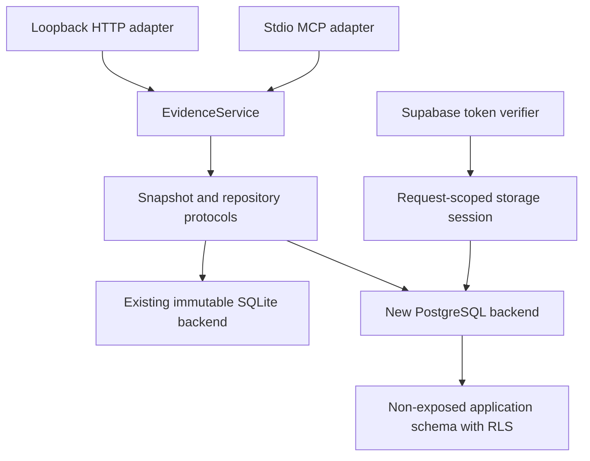
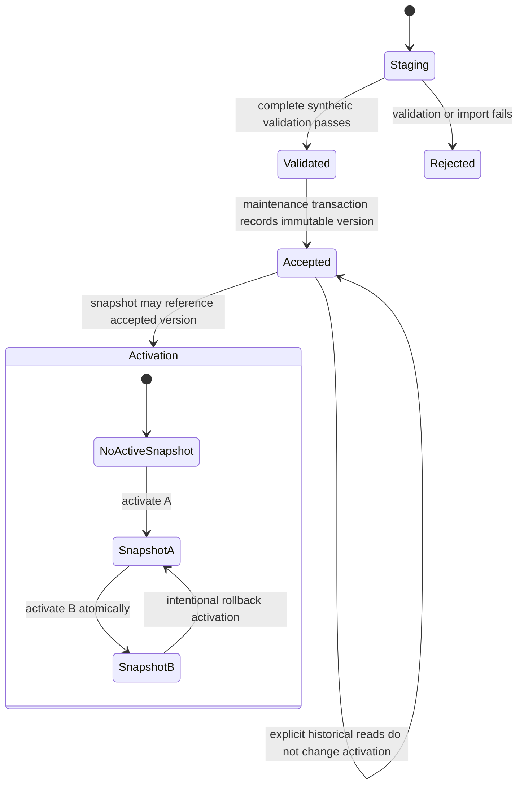
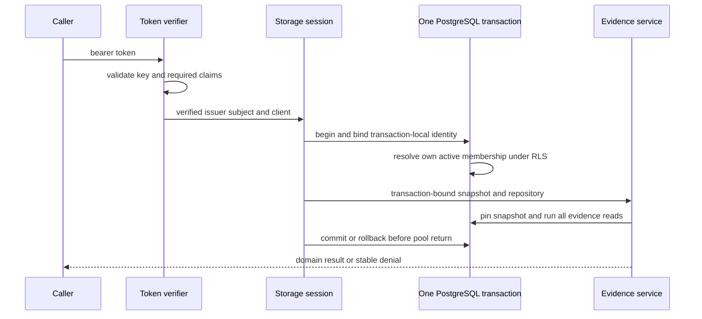

# Phase 1 PostgreSQL and Supabase Auth Foundation - Plan

## Goal Capsule

- **Objective:** Establish a source-independent Phase 1 foundation in which PostgreSQL can reproduce the current Passage evidence contract and Supabase identities can be authorized as current Passage members, without changing the working local SQLite runtime or exposing Passage remotely.
- **Means:** Add a backend-neutral snapshot boundary, an imperative Supabase migration set, a synchronous PostgreSQL adapter, request-scoped database transactions, and fresh application-side membership checks under the accepted Supabase Auth limitation (KTD1-KTD10).
- **Authority:** Apply this order:
  1. `AGENTS.md` and `.agents/skills/passage-grounding/SKILL.md` control execution.
  2. `wiki/decisions.md` controls decisions.
  3. `docs/specs/2026-08-23-passage-product-specification.md` controls approved future behavior.
  4. Current code and tests prove implemented behavior.
- **Execution profile:** Use synthetic fixtures only. Land small vertical slices with focused tests before the complete source-independent gate.
- **Stop conditions:** Stop before private-source use, real-corpus acceptance or activation, a hosted project link, public HTTPS, transactional email, member invitations, deployment, or a change that weakens the SQLite reference contract.
- **Tail ownership:** The implementing session updates the living wiki with exact implemented state. Hosted OAuth regression and remote-alpha delivery remain separate, maintainer-authorized work.

---

## Product Contract

### Summary

Passage will retain Supabase Auth and move into the PostgreSQL foundation that the failed P6 gate previously blocked.
This plan accepts the known wrong-resource behavior for the invite-only hobby service while retaining basic token integrity, explicit consent, current membership, least privilege, and read-only-first controls.
The implementation remains local and synthetic.

### Problem Frame

The live Claude proof showed that Supabase Auth works for discovery, dynamic registration, PKCE, exact callback consent, asymmetric token validation, refresh, MCP access, and immediate disabled-member enforcement.
It also showed that Supabase ignored a deliberately wrong RFC 8707 resource before the custom hook assigned the Passage audience.
The repository treated that standards failure as a complete Phase 1 blocker even though the realistic consequence is unauthorized Passage access after a member approves a malicious client, not compromise of a member's device or Claude, Codex, Anthropic, or OpenAI credentials.

The current checkout has no PostgreSQL application schema, migration, repository, membership model, or Auth implementation.
Its working runtime remains immutable SQLite artifacts, loopback HTTP, and stdio MCP.
Phase 1 must add the future foundation without weakening or misdescribing that baseline.
Doing the PostgreSQL foundation before remote alpha avoids deploying a temporary mutable-membership store beside SQLite and then replacing it when notes and owner-managed membership arrive. The local parity checkpoint and the Auth checkpoint remain independently visible so a provider-specific delay does not hide completed persistence work.

### Key Decisions

- **Retain Supabase Auth for the invite-only hobby service** (session-settled: user-directed — chosen over identity-provider migration: the accepted limitation affects Passage access, not friends' devices or chat-provider accounts). Governs R1, R2, R10, R11.
- **Use proportionate hobby-project controls** (session-settled: user-directed — chosen over enterprise-SaaS hardening: Passage serves a small trusted group and does not hold sensitive application data). Governs R3, R9, R12.

### Requirements

**Decision and authorization boundary**

- R1. Passage must record Supabase Auth's wrong-resource behavior as an accepted compatibility limitation and must not claim that P6 passed or that strict RFC 8707 resource binding exists.
- R2. Passage must use supported OIDC claims for identity and must enforce member and tool capabilities in the application rather than depending on Passage-specific OAuth scopes.
- R3. Security work must address practical risks to Passage accounts and data without adding enterprise administration, compliance systems, or speculative scale controls.

**Runtime and persistence**

- R4. The current SQLite, loopback HTTP, and stdio MCP runtime must remain the default reference until a separately approved PostgreSQL cutover passes parity acceptance.
- R5. PostgreSQL must preserve stable canonical identities, complete staged builds, whole-version validation, separate acceptance and activation, immutable accepted versions, one immutable retrieval-snapshot identity, atomic active-snapshot selection, and old-snapshot resolvability.
- R6. Passage application tables must live outside Supabase Data API exposure and use explicit least-privilege roles plus row-level security as defense in depth.
- R7. Normal requests must use a non-owner role that cannot bypass RLS and must receive verified member identity as transaction-local context.

**Contract parity**

- R8. PostgreSQL must implement the existing domain-service operations through a backend-neutral storage boundary without adding database or Auth shapes to public evidence models.
- R9. Backend parity must strictly compare passage and provenance fields, canonical order outside ranked search, bounds, stable errors, snapshot selection, failed activation, and old-version access. Lexical parity must compare the complete eligible result set and per-backend deterministic pagination. Retrieval identity, score components or values, rank order, and rank-dependent page membership may differ between SQLite and PostgreSQL.

**Identity and scope**

- R10. Token verification must validate asymmetric signature, allowed algorithm, key, one exact configured Supabase issuer, Passage audience, expiry, subject, and an accepted client identity before an identity can reach application authorization.
- R11. Every authorized operation must check current owner-managed membership by token subject; disabled and non-allowlisted identities must fail before evidence dispatch.
- R12. Routine development must use synthetic identities and fixtures only and must leave hosted OAuth, passwordless delivery, private sources, remote deployment, note tools, and public access closed.

### Success Criteria

- The same synthetic snapshot produces equivalent Passage domain results through the SQLite and PostgreSQL repositories under their declared retrieval configurations, with only the ranked-search differences named in R9.
- A failed PostgreSQL build or activation leaves the prior active snapshot unchanged, and an older explicit snapshot remains resolvable after successor activation.
- The normal PostgreSQL request role cannot bypass RLS or reach non-exposed application tables through Supabase's Data API roles.
- Valid synthetic Supabase tokens map only to active Passage members; invalid, disabled, and non-allowlisted identities are rejected before evidence service dispatch.
- The current loopback HTTP and stdio MCP tests continue to pass without a remote bind or transport change.

### Acceptance Examples

- AE1. **Covers R1, R2, R10, R11.** Given a correctly signed Passage-audience token produced after the known wrong-resource flow, when its subject is an active member, then Passage may grant only the application-authorized read capability and records no claim that resource binding passed.
- AE2. **Covers R10, R11.** Given an otherwise valid unexpired token for a member who is disabled, when the next authorized operation begins, then Passage denies the request before evidence dispatch.
- AE3. **Covers R6, R7.** Given an authenticated Supabase Data API caller or a normal Passage request role without transaction-local member context, when it queries application tables, views, or functions, then the Data API cannot resolve the schema and RLS returns no authorized application data.
- AE4. **Covers R5, R9.** Given one active PostgreSQL snapshot, when a successor activation fails, then unpinned requests still resolve the original snapshot and no mixed-version response is possible.
- AE5. **Covers R8, R9.** Given matching synthetic corpus inputs, when exact lookup, context, lexical search, and official traversal run through both backends, then non-ranked domain payloads and stable errors match, lexical search produces the same complete eligible set, and each backend paginates deterministically under its own retrieval configuration.
- AE6. **Covers R4, R12.** Given the Phase 1 changes are installed, when Passage starts through its existing local entry points, then HTTP remains loopback-only and MCP remains stdio unless a later explicitly configured composition is selected.

### Scope Boundaries

**In scope**

- Loopback-safe synthetic PostgreSQL development and migration verification.
- An imperative Supabase migration workflow.
- Backend-neutral storage and snapshot composition.
- The versioned PostgreSQL corpus, retrieval-snapshot, activation, and membership foundation with operational timestamps on owning records.
- A synchronous PostgreSQL repository and parity suite.
- Local token-verification and fresh membership-authorization components.

**Deferred to Follow-Up Work**

- The Phase 2 remote MCP operation-name reconciliation and public Streamable HTTP composition.
- The bounded live Claude regression, public HTTPS harness, hosted configuration, and remote deployment.
- Passwordless email provider and sender-domain selection.
- Phase 3 notes, member removal, backup retention, and note recovery.
- Complete-canon identity expansion, private-source migration, real-corpus activation, derived edges, vectors, and semantic retrieval.

**Outside this plan's authority**

- Processing or importing private source bytes or repair candidates.
- Accepting or activating any real corpus.
- Linking, pushing, resetting, or migrating a hosted Supabase project.
- Inviting friends, deploying a public service, or submitting a public plugin.

### Product Contract Preservation

The approved product direction is narrowed to the local Phase 1 foundation.
The 2026-08-24 Supabase Auth decision supersedes the earlier provider reopening and strict P6 block without changing the historical proof result.

---

## Planning Contract

### Key Technical Decisions

- KTD1. **Treat P6 as a known exception, not a hidden pass.** (session-settled: user-directed — chosen over identity-provider migration: the practical residual risk is bounded to Passage after user consent). Preserve the failed proof, retain exact resource-server audience validation, and rely on explicit consent plus fresh application authorization for R1, R10, and R11.
- KTD2. **Use application capabilities rather than custom OAuth scopes.** Supabase Auth supplies identity through standard OIDC claims; Passage grants evidence-read now and later note capabilities only through its own authorization boundary (R2).
- KTD3. **Use imperative Supabase migrations.** `supabase/config.toml` has no declarative schema paths, and the CLI migration workflow is the smallest conventional starting point. Migration filenames are generated by the current CLI during implementation.
- KTD4. **Keep the synchronous core and offload HTTP operations.** Use Psycopg 3 with bounded synchronous pools behind repository protocols. Run complete synchronous service operations through FastAPI's worker-thread path so database latency does not block the event loop.
- KTD5. **Use a dedicated non-exposed application schema and distinct login paths.** Keep application tables outside `public` and `graphql_public`, revoke ambient privileges, index foreign keys and policy columns, and authenticate request and maintenance connections through separate DSNs. The request login is non-owner, non-`BYPASSRLS`, cannot inherit or assume maintenance privileges, and receives no maintenance DSN. RLS limits accidental unscoped application queries and Data API reachability; it does not protect against compromise of the Passage process or its request credential (R6, R7).
- KTD6. **Extract request-scoped storage composition below `EvidenceService`.** Define control, storage-session, snapshot, and repository protocols matching the methods the service consumes. Keep SQLite as the default implementation and inject PostgreSQL through the existing factory pattern (R4, R8).
- KTD7. **Preserve logical identities and declare one complete retrieval-snapshot identity.** Preserve the accepted manifest's identity scheme with synthetic manifest values in this plan; importing real accepted-manifest identities remains separately authorized work. Create a distinct PostgreSQL retrieval configuration and an immutable snapshot that explicitly binds baseline or empty identities for deferred graph, vocabulary, vector, and publication-policy components (R5, R9).
- KTD8. **Keep this plan local and source-independent.** Build token verification and membership authorization as reusable components, but defer the public remote adapter and live OAuth regression until the PostgreSQL foundation and contract decisions are stable (R3, R12).
- KTD9. **Use one short request transaction.** After token verification, one checked-out request-role connection applies the verified issuer, subject, and client through parameter-bound `set_config(..., true)` calls. The same transaction resolves current membership under RLS, pins one snapshot, performs all repository reads, and resets through commit or rollback before pool return. Never interpolate token claims into `SET` statements.
- KTD10. **Enforce lifecycle state and accepted-version immutability in PostgreSQL.** A unique build identity has one writer claim. Database constraints allow only staging-to-validated-to-accepted or rejected transitions. Accepted child records reject update and delete, and activation changes only the singleton snapshot pointer.

### High-Level Technical Design

### Data Model Direction

- **Corpus lifecycle:** Source and edition metadata, corpus versions, versioned passages, apparatus, official edges, retrieval configurations, retrieval snapshots, and one active-snapshot pointer.
- **Stable identity:** Canonical passage identity is separate from each versioned passage record. Synthetic fixtures preserve the accepted manifest's identity scheme; real manifest values remain outside this plan.
- **Membership:** One exact Supabase issuer is configured per environment, so its `sub` is the member identity. Membership stores only the role, active state, and minimal timestamps needed for authorization.
- **Operational history:** Keep build, lifecycle, activation, and membership timestamps on their owning records. Defer a generic audit-event schema until a real owner/member mutation or retention requirement needs it. Do not log tokens, email addresses, source excerpts, or study queries.
- **Search:** PostgreSQL uses a stored `tsvector` and GIN index. Pagination uses a deterministic rank-and-canonical-order key bound to the PostgreSQL retrieval configuration.

### Sequencing

1. Run U1 and U2 independently: make the database harness safe while characterizing and extracting the SQLite storage seam.
2. Land U3 schema, privileges, shared connection layer, transaction context, and policy tests after U1.
3. Run U4 lifecycle work and U6 Auth membership work as independent branches after U3.
4. Complete U5 repository parity after U2 and U4.
5. Record the independently useful PostgreSQL parity checkpoint after U5.
6. Complete U7 authenticated composition after U5 and U6, then run the complete source-independent gate.

### System-Wide Impact

- **Members:** No user-visible service is released by this plan. The future member identity boundary becomes testable with synthetic subjects.
- **Developers:** Persistence becomes a replaceable adapter while existing domain models and public local operations remain stable.
- **Operations:** Local Supabase must be loopback-contained. Hosted configuration, secrets, email, backup, and deployment remain closed.
- **Agents and clients:** Current local HTTP and stdio MCP behavior remains the oracle. Consent and administration stay human-only. Phase 2 remote tool parity is follow-up work.
- **Data lifecycle:** PostgreSQL adds mutable staging and operational records around immutable accepted versions. No real corpus data enters the new store in this plan.

### Risks and Dependencies

- **Local port publication:** The current Docker Desktop path exposes configured ports on all interfaces. U1 must fix or replace this harness before database integration proceeds.
- **Provider churn:** Supabase Auth and CLI are changing products. Implementation must re-read current official docs and CLI `--help` before configuration or migration work.
- **P6 residual risk:** A member could approve a malicious client that receives a Passage-valid token. The future consent flow must show client and callback identity, and application authorization must bound the resulting Passage access.
- **DCR client instability:** Do not assume a Claude dynamic client ID is stable across members or reconnections. Characterize it before using client ID as an allowlist key.
- **Provisional client policy:** Phase 1 accepts only environment-configured synthetic client identifiers. The real Claude acceptance predicate remains open until the bounded live regression characterizes a stable provider-observed attribute.
- **Ranking divergence:** FTS5 and PostgreSQL ranking are not numerically equivalent. The parity oracle compares contract behavior under separate retrieval identities, not raw scores.
- **Role configuration:** Exact managed-role login and transaction context details depend on the local Supabase runtime. U3 owns verification before application code depends on them.
- **Pooled context leakage:** A session-level setting or incomplete rollback could authorize the next request on a reused connection. KTD9 requires transaction-local context and forced connection-reuse tests for success, error, rollback, and cancellation.
- **Migration rollback:** Before cutover, a failed PostgreSQL migration or composition is discarded through a clean local reset and SQLite remains the runtime. No recovery step may mutate Supabase-managed schemas or a hosted project.
- **Cutover authority:** Completion of this plan supplies local parity and rollback evidence but does not itself select the cutover event or retire SQLite. The separately approved cutover resolves product-specification question O13.

### Sources and Research

- `docs/plans/2026-08-23-supabase-claude-oauth-compatibility-proof.md` records the exact live pass and failure evidence.
- `src/passage/evidence/service.py`, `src/passage/evidence/snapshot.py`, and `src/passage/db/repository.py` define the current persistence coupling and domain boundary.
- `tests/contract/test_interface_parity.py`, `tests/api/test_http_api.py`, and `tests/mcp/test_mcp_tools.py` define the current shared-contract oracle.
- [Supabase MCP authentication](https://supabase.com/docs/guides/auth/oauth-server/mcp-authentication) documents DCR, consent, token validation, refresh, and its client-registration warning.
- [Supabase token security](https://supabase.com/docs/guides/auth/oauth-server/token-security) documents client-specific claims, custom audiences, and RLS controls.
- [MCP authorization](https://modelcontextprotocol.io/specification/2025-11-25/basic/authorization) remains the authority showing that exact resource indicators are required even though Passage accepts Supabase's deviation.

---

## Implementation Units

### U1. Establish a loopback-safe PostgreSQL test foundation

- **Goal:** Make local synthetic PostgreSQL and migration verification safe and repeatable before schema work begins.
- **Requirements:** R3, R4, R12.
- **Dependencies:** None.
- **Files:** `supabase/config.toml`, `docs/development/supabase-local.md`, `tests/postgres/conftest.py`, `tests/postgres/test_local_environment.py`.
- **Approach:** Document one project-supported Supabase CLI acquisition path and validate a compatible version before stack startup. The verified `2.115.0` environment is the initial floor, not a forever pin. Use current CLI help to confirm local commands and select the imperative migration workflow from KTD3. Prove every published Passage port is loopback-only before yielding a database fixture. Keep seed data disabled and omit local keys from logs. If the current Docker Desktop route cannot meet the boundary after one bounded correction cycle, stop and document an isolated PostgreSQL alternative rather than weakening loopback policy. Do not claim Supabase Data API, `anon`, or GraphQL exposure proof from a plain-PostgreSQL fallback. Those checks remain open until a Supabase stack is available.
- **Execution note:** This is environment scaffolding; seek a runtime smoke proof and an automatically checked port-boundary failure before adding application schema.
- **Patterns to follow:** `docs/development/supabase-local.md`, `supabase/config.toml`, `tests/integration/conftest.py`.
- **Test scenarios:**
  - A healthy local stack with every configured port on `127.0.0.1` yields the PostgreSQL fixture.
  - Any `0.0.0.0` or `[::]` publication fails the fixture before migrations or tests use the stack.
  - Captured setup output contains no local API keys, database credentials, or full status JSON.
  - A missing or incompatible Supabase CLI fails before startup with the supported acquisition and version command.
  - Teardown stops the Passage project even after a test failure.
- **Verification:** A clean checkout with the documented CLI prerequisite can create and tear down the synthetic database fixture without network exposure or secret-bearing output.

### U2. Extract backend-neutral snapshot and repository contracts

- **Goal:** Remove SQLite type coupling from the evidence service while preserving all current behavior.
- **Requirements:** R4, R8, R9.
- **Dependencies:** None.
- **Files:** `src/passage/db/contracts.py`, `src/passage/db/control.py`, `src/passage/db/repository.py`, `src/passage/evidence/snapshot.py`, `src/passage/evidence/service.py`, `tests/integration/test_evidence_service.py`, `tests/contract/test_interface_parity.py`.
- **Approach:** Define the smallest protocols for control state, request-scoped storage sessions, pinned snapshots, repository reads, backend-neutral lexical query intent, and cleanup. Move FTS5 compilation and SQLite exception translation into the SQLite adapter so each repository compiles native search syntax and the service raises shared domain errors. Adapt the current SQLite classes to the protocols. Continue composing SQLite through the existing factory injection in HTTP and MCP. Keep request and response models unchanged.
- **Execution note:** Add characterization coverage for the current service and snapshot lifecycle before changing concrete types.
- **Patterns to follow:** Factory injection and lifecycle cleanup in `src/passage/http/app.py` and `src/passage/mcp/server.py`.
- **Test scenarios:**
  - Every current evidence operation returns the same payload and stable error after the protocol extraction.
  - An explicitly selected snapshot requires both corpus and retrieval identities.
  - Repository resources close after normal completion, domain failure, startup failure, and cancellation.
  - HTTP and MCP adapters still call one matching shared service operation without backend conditionals.
  - Phrase, terms, prefix, and proximity requests reach the SQLite adapter as structured intent and preserve current results and errors.
- **Verification:** Existing SQLite integration, API, MCP, contract, and acceptance behavior is unchanged while `EvidenceService` no longer names concrete SQLite types.

### U3. Add the versioned PostgreSQL schema, roles, and RLS policies

- **Goal:** Create the durable Phase 1 data model and its least-privilege authorization boundary.
- **Requirements:** R5, R6, R7, R11.
- **Dependencies:** U1.
- **Files:** `supabase/migrations/<generated>_phase1_foundation.sql`, `src/passage/db/postgres/__init__.py`, `src/passage/db/postgres/connection.py`, `pyproject.toml`, `uv.lock`, `tests/postgres/conftest.py`, `tests/postgres/test_schema.py`, `tests/postgres/test_rls.py`, `docs/development/supabase-local.md`.
- **Approach:** Add Psycopg 3 and the bounded request and maintenance connection pools shared by later units. Create lowercase objects in a dedicated non-exposed schema. Model canonical identities separately from versioned records. Add corpus lifecycle, a complete immutable retrieval-snapshot binding, singleton activation, and membership tables; keep operational timestamps on those records rather than creating a generic audit schema. Enforce KTD10 state transitions and accepted-row immutability. Use appropriate Postgres types, explicit constraints, indexed foreign keys, a GIN full-text index, a non-bypass request login, and a narrow maintenance login with no inheritance path between them. Revoke ambient schema and object privileges. Enable and force RLS where request identity applies. Let the request role apply only verified, parameter-bound transaction-local identity and read only its own member row under RLS.
- **Patterns to follow:** `src/passage/db/migrations/001_control.sql`, `src/passage/db/migrations/002_corpus.sql`, and the repository's Supabase PostgreSQL best-practice skill.
- **Test scenarios:**
  - A fresh local database applies the full migration once and exposes the expected constraints, indexes, roles, and policies.
  - Duplicate canonical identities, incompatible version references, missing provenance, and invalid lifecycle states fail at the database boundary.
  - The request role without transaction-local member context reads no protected rows and cannot perform maintenance mutations.
  - An active member context can read permitted evidence rows; a disabled or absent member context cannot.
  - The application schema is absent from Supabase API schemas and extra search paths; REST and GraphQL probes using `anon` and authenticated credentials cannot resolve its tables, views, or functions.
  - The maintenance role can perform only the lifecycle operations required by later units and cannot bypass unrelated authorization silently.
  - Request and maintenance pools use distinct environment-sourced DSNs; request connections report the non-bypass login, cannot assume maintenance, and connection failures redact credentials.
  - The same pooled connection is reused after success, error, rollback, and cancellation without retaining transaction-local identity or authorized rows.
- **Verification:** Schema inspection and policy integration tests prove the migration, privileges, RLS, and index contract from an empty database.

### U4. Implement synthetic PostgreSQL staging, validation, and activation

- **Goal:** Reproduce the current complete-build and atomic-activation lifecycle with synthetic corpus data.
- **Requirements:** R5, R7, R12.
- **Dependencies:** U3.
- **Files:** `src/passage/db/postgres/control.py`, `src/passage/db/postgres/importer.py`, `src/passage/db/postgres/validation.py`, `tests/postgres/test_import.py`, `tests/postgres/test_lifecycle.py`.
- **Approach:** Use U3's maintenance pool. Claim one unique build key and create one attempt identity before importing normalized synthetic records in batches into one staging corpus. A failed attempt becomes rejected; retry takes a new attempt identity and removes only staging rows owned by prior rejected attempts, never resumes rows across attempts, and never reuses an accepted identity. Reconcile per-table counts, digests, anti-joins, source spans, official targets, and stored search-vector coverage before acceptance. Keep external work outside transactions. Conditionally promote only the validated digest in one short transaction, enforce KTD10 immutability, and switch only the active snapshot pointer. Preserve the manifest identity scheme with synthetic values and assign a PostgreSQL-specific retrieval configuration and complete snapshot identity.
- **Execution note:** Implement lifecycle invariants test-first, including injected failures at each transaction boundary.
- **Patterns to follow:** `src/passage/db/builder.py`, `src/passage/db/control.py`, `src/passage/db/validation.py`, `tests/integration/test_atomic_promotion.py`.
- **Test scenarios:**
  - A valid synthetic corpus imports completely, validates, becomes accepted, and remains inactive until explicit activation.
  - Re-import of the same build identity is idempotent and does not mutate the accepted version.
  - Two concurrent importers for the same build identity produce one writer and one safe retry result without interleaved rows.
  - Retry after a partial staging failure rejects the prior attempt, creates a new attempt, cleans only rows owned by rejected attempts, and cannot reuse an accepted identity.
  - Duplicate, incomplete, or provenance-inconsistent staging data is rejected without an accepted corpus.
  - Missing, extra, or tampered passage, apparatus, edge, span, or search-vector records fail whole-version reconciliation.
  - Direct update or delete of accepted corpus children is rejected, and foreign-key deletion uses restrictive behavior.
  - Failure before or during activation leaves the prior active snapshot unchanged.
  - Activating an incompatible corpus and retrieval pair fails.
  - An accepted older snapshot remains registered and resolvable by the control layer after a successor activates.
- **Verification:** PostgreSQL lifecycle tests demonstrate the same acceptance and activation invariants as the SQLite reference without using a private source.

### U5. Add the PostgreSQL repository and backend parity matrix

- **Goal:** Serve the existing evidence contract from PostgreSQL with explicit backend-specific retrieval identity.
- **Requirements:** R4, R8, R9.
- **Dependencies:** U2, U4.
- **Files:** `src/passage/db/postgres/repository.py`, `src/passage/evidence/snapshot.py`, `src/passage/evidence/service.py`, `tests/postgres/test_repository.py`, `tests/contract/test_backend_parity.py`, `tests/contract/test_interface_parity.py`, `tests/acceptance/test_agent_research_flow.py`.
- **Approach:** Lock one named synthetic corpus and request matrix before repository implementation. It covers every lexical mode, empty and single-row results, exact rank ties, page boundaries, filters, non-ASCII and case-varying text, multi-span provenance, official cycles and external targets, cross-version references, snapshot transitions, and stable errors. Implement exact lookup, context, PostgreSQL-native full-text compilation, official-edge loading, range bounds, counts, and transaction-bound snapshot cleanup behind the U2 contracts. Use deterministic pagination under the PostgreSQL retrieval configuration. Define a field-level comparator that is strict for non-ranked operations and compares the fully exhausted eligible lexical set while permitting R9's named ranking and page differences.
- **Execution note:** Start with the cross-backend parity cases and add repository behavior only as each case requires it.
- **Patterns to follow:** `src/passage/db/repository.py`, `src/passage/evidence/lexical.py`, `src/passage/evidence/references.py`.
- **Test scenarios:**
  - Exact lookup and context return equivalent passages, canonical order, source spans, and provenance across backends.
  - Lexical search returns the same complete eligible record set and bounds after exhausting pages; each backend has deterministic ordering, truncation, and continuation under its distinct retrieval identity.
  - Official traversal returns equivalent paths, external targets, frontier, and stable ordering.
  - Invalid queries, absent passages, unavailable versions, incompatible configurations, and empty results map to the same domain errors and envelopes.
  - One request pins one snapshot even if a successor activates concurrently.
  - An accepted older snapshot remains queryable by its explicit corpus and retrieval identities after a successor activates.
  - A cursor cannot be replayed across retrieval configurations or backends.
- **Checkpoint:** When U5 passes, record PostgreSQL lifecycle and contract parity as complete independently of the later synthetic Auth composition. This is cutover evidence, not cutover authority.
- **Verification:** The backend parity matrix and existing transport parity suite pass while documenting the permitted PostgreSQL ranking differences.

### U6. Implement Supabase token verification and current membership authorization

- **Goal:** Turn a verified Supabase subject into a fresh Passage authorization decision without trusting stale or user-editable authorization claims.
- **Requirements:** R1, R2, R3, R10, R11, R12.
- **Dependencies:** U3.
- **Files:** `src/passage/auth/__init__.py`, `src/passage/auth/models.py`, `src/passage/auth/tokens.py`, `src/passage/auth/authorization.py`, `src/passage/config.py`, `src/passage/db/postgres/membership.py`, `pyproject.toml`, `uv.lock`, `tests/unit/auth/test_tokens.py`, `tests/unit/auth/test_authorization.py`, `tests/postgres/test_membership.py`.
- **Approach:** Add PyJWT with its cryptography support as the direct JOSE dependency. Do not hand-roll signature verification. Validate only asymmetric tokens from one exact configured Supabase issuer and an injected key source. Require the Passage audience, expiry, subject, and authoritative Supabase client claim. Pass the client through an injected environment-configured allowlist policy that fails closed and uses synthetic identifiers only in this plan. The real Claude predicate remains deferred. Absent, blank, or partial issuer, audience, key-source, or client-policy configuration fails at construction. After verification, open the KTD9 request transaction, apply issuer, subject, and client with bound `set_config(..., true)` calls, then query only the caller's membership row under RLS before pinning and dispatch. Treat email and user metadata as non-authoritative. Keep hosted JWKS retrieval and rotation policy, callback restrictions, and explicit consent as requirements for the later remote composition.
- **Execution note:** Use synthetic signing keys and claims. Add every negative token and membership case before wiring an authenticated request path.
- **Patterns to follow:** Stable typed errors in `src/passage/domain/errors.py` and dependency injection in `src/passage/http/dependencies.py`.
- **Test scenarios:**
  - A valid configured token for an active member produces an evidence-read request context.
  - Forged, expired, wrong-key, wrong-algorithm, wrong-issuer, wrong-audience, missing-subject, missing-client, malformed-client, rejected-client, and conflicting-client tokens fail without evidence dispatch.
  - Two tokens with the same subject but different issuers cannot map to the same member because the nonconfigured issuer fails before database access.
  - A token issued to another registered OAuth client fails the accepted-client policy even when its signature and Passage audience are valid.
  - Each absent, blank, or partial auth setting prevents verifier construction rather than disabling a claim check.
  - Quoting characters in an otherwise valid synthetic subject or client value are parameter-bound safely, or fail declared claim-shape validation, without changing transaction state.
  - An active token for a disabled or non-allowlisted subject fails on the next authorization decision.
  - Re-enabling a member restores authorization only through a fresh membership check.
  - User-editable metadata cannot grant membership or owner role.
  - Forced reuse of one pooled connection after success, exception, rollback, and cancellation leaves no prior member context or authorized rows.
  - Token values, emails, claims, database passwords, and full DSNs do not appear in routine logs, configuration representations, startup errors, or stable error payloads.
- **Verification:** Unit and PostgreSQL integration tests prove token integrity, fresh membership, transaction context, and sanitized failures independently of a hosted provider.

### U7. Compose the PostgreSQL runtime without changing local defaults

- **Goal:** Make the PostgreSQL backend selectable for source-independent validation while retaining the SQLite local baseline and closed remote boundary.
- **Requirements:** R4, R8, R9, R10, R11, R12.
- **Dependencies:** U5, U6.
- **Files:** `src/passage/runtime.py`, `src/passage/config.py`, `src/passage/http/app.py`, `src/passage/http/routes/corpus.py`, `src/passage/http/routes/evidence.py`, `src/passage/http/routes/passages.py`, `src/passage/mcp/server.py`, `src/passage/cli.py`, `tests/integration/test_authenticated_operation.py`, `tests/api/test_http_api.py`, `tests/mcp/test_mcp_tools.py`, `tests/contract/test_interface_parity.py`, `tests/acceptance/test_agent_research_flow.py`, `wiki/overview.md`, `wiki/concepts/postgresql-platform.md`, `wiki/concepts/study-group-access.md`, `wiki/log.md`.
- **Approach:** Centralize backend composition in one runtime factory. Add an internal synthetic authenticated-operation runner that owns token verification, request-role checkout, parameter-bound identity context, fresh membership, snapshot pinning, evidence dispatch, and commit or rollback on the same connection. Keep existing entry points on SQLite unless an explicit source-independent PostgreSQL validation configuration is supplied. Route synchronous HTTP service operations through FastAPI's worker-thread execution path. Load request and maintenance DSNs from separate environment settings with redacted representations and no committed credential defaults. Preserve loopback middleware and stdio transport. Do not add a public bind, hosted credentials, OAuth consent endpoint, remote tool rename, or deployment configuration.
- **Test scenarios:**
  - Default CLI, HTTP, and MCP startup still select SQLite and enforce current loopback/stdio boundaries.
  - Explicit PostgreSQL validation composition runs the shared evidence flow against a synthetic active snapshot.
  - A synthetic active member completes verifier-to-evidence dispatch on one request transaction; a disabled member is denied before the repository call.
  - Runtime connections report the request login, cannot assume maintenance privileges, and never receive the maintenance DSN.
  - Missing or partial PostgreSQL configuration fails closed without falling back to a different backend silently.
  - Startup and cancellation close database pools and stores for both backends.
  - Concurrent slow PostgreSQL requests do not block unrelated FastAPI event-loop work, and cancellation closes or rolls back the request transaction.
  - No note, admin, activation, remote, or bulk-export tool becomes discoverable.
  - Living wiki updates distinguish the implemented local foundation from unimplemented remote delivery and real-corpus work.
- **Verification:** Both backend compositions pass the shared contract and lifecycle suites, the synthetic authenticated-operation proof passes, the full source-independent gate passes, and the wiki health check reports no drift.

---

## Verification Contract

| Gate | Applies to | Required evidence |
|---|---|---|
| Focused unit checks | U1-U7 | Each unit's named test files pass before dependent work begins. |
| Local environment | U1 | The documented CLI prerequisite and current `--help` are verified; every published port is loopback-only before the fixture is yielded. |
| Supabase migration verification | U3 | The loopback-safe local database resets from empty, applies all migrations, and lists one coherent migration history. |
| PostgreSQL policy proof | U3, U6 | Normal, missing-context, disabled-member, Data API, and maintenance-role cases produce the expected allowed or denied rows. |
| Lifecycle and pool isolation | U3, U4, U6, U7 | Concurrent lifecycle transitions preserve one accepted identity and one active pointer; forced pool reuse after success, error, rollback, and cancellation reveals no prior request context. |
| Backend parity | U5, U7 | `uv run pytest tests/contract/test_backend_parity.py tests/contract/test_interface_parity.py tests/acceptance/test_agent_research_flow.py` passes for the locked synthetic matrix. |
| Auth negatives | U6 | `uv run pytest tests/unit/auth tests/postgres/test_membership.py tests/postgres/test_rls.py` passes with no secret-bearing assertion output. |
| Authenticated operation | U7 | A synthetic signed token reaches evidence only through one current-member, request-role transaction; a disabled member fails before repository dispatch. |
| Complete source-independent gate | U7 | `uv sync --all-extras --dev`, `uv run ruff format --check .`, `uv run ruff check .`, `uv run mypy src`, and `uv run pytest` pass. |
| Repository hygiene | U7 | `git diff --check` passes; no private artifacts, credentials, generated databases, or unrelated user changes enter the diff. |
| Wiki health | U7 | Every page has required frontmatter; local links, index coverage, decision alignment, and implemented-versus-approved claims are consistent. |

No test in this plan may use a private repair candidate or claim corpus acceptance, editorial fidelity, hosted OAuth readiness, or remote deployment fitness.

---

## Definition of Done

- U1-U7 meet their verification outcomes with synthetic fixtures.
- Supabase Auth is documented as selected, P6 remains documented as failed, and no strict RFC 8707 compliance claim exists.
- SQLite remains the default local baseline and passes its existing tests unchanged.
- PostgreSQL reproduces the agreed domain, lifecycle, snapshot, and error contract under its own retrieval configuration.
- Every accepted PostgreSQL snapshot has one complete immutable retrieval identity, including explicit baseline identities for deferred components, and older snapshots remain resolvable after activation changes.
- Normal PostgreSQL requests cannot bypass RLS or use Supabase Data API roles to reach application tables.
- Reused PostgreSQL connections retain no member, client, or snapshot context after success, error, rollback, or cancellation.
- Token verification and current-member authorization reject all specified negative cases before evidence dispatch.
- The accepted-client policy is synthetic and fail-closed; no claim is made that a stable Claude DCR acceptance key has been selected.
- The repository contains no private source bytes, private artifacts, credentials, hosted project link, or public deployment configuration.
- The complete source-independent quality gate and documentation checks pass.
- The living wiki states exactly what is implemented and keeps remote alpha, transactional email, private-source work, real-corpus acceptance and activation, and deployment gates closed.
- Dead-end scaffolding, experimental migrations, unused adapters, and abandoned dependency choices are removed from the final diff.
