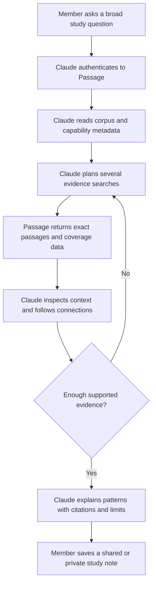

# Passage Product Specification

## Status and Decision Labels

This is the approved product specification. Approval authorizes the documentation actions in Section 14. It does not authorize implementation, corpus acceptance, activation, private-source processing, deployment, or public submission.

- **Confirmed** means the maintainer approved the direction during the product interview.
- **Recommended** means an initial threshold or operating choice that the product must test before treating it as permanent.
- **Hypothesis** means the product must test the claim before it relies on it.
- **Open** means later planning or evidence must resolve the item.

## 1. Product Thesis and Problem Statement

Passage is a structured evidence and relationship platform for LDS gospel study. It gives existing chat models exact, inspectable access to scripture and, later, teachings from Church leaders. Claude or ChatGPT performs the live research loop, detects patterns, explains relationships, and creates requested visual material. Passage supplies verified records, citations, retrieval, explicit connections, and coverage data.

The main problem is not simple verse lookup. A person can already look up a known reference. The difficult job is to survey a large corpus for related language, themes, contrasts, explanations, fulfillments, narrative parallels, and links between scripture and modern teaching. Manual study can miss distant or indirect connections. A chat model can search broadly, but it needs a stable evidence system so that every claim remains tied to a source.

Passage must improve discovery without claiming that a generated interpretation is authoritative. It must show what came from a source, what came from official apparatus, what a model derived, which retrieval paths ran, and where coverage was incomplete.

**Product requirements**

- R1. Passage must help a member conduct a broad, citation-ready survey of a normal gospel-study question in Claude or ChatGPT.
- R2. Passage must support pattern discovery across the complete English LDS scripture canon and later across every Church-supplied English General Conference talk PDF included in a dated accepted source catalog.
- R3. Passage must return evidence and relationships, not an authoritative doctrinal conclusion.
- R4. Passage must preserve stable identities, exact citations, provenance, corpus versions, and retrieval configuration for every evidence trail.

## 2. Target Users and Jobs to Be Done

### Study-group member

The primary user is a member of a small, trusted scripture study group. The member uses an individual Claude or ChatGPT account.

The member needs to:

- ask a broad gospel-study question in ordinary language;
- discover relevant passages and connections across the corpus;
- inspect exact passages, surrounding context, and relationship evidence;
- distinguish official source links from model-derived relationships;
- understand search coverage and remaining uncertainty;
- save a citation-linked study note; and
- read notes shared by other group members.

### Passage owner

The owner maintains sources, accepts corpus versions, controls group membership, runs enrichment and evaluation, monitors the service, and restores data when necessary.

The owner must not need to propose the patterns that the enrichment system should find. The owner starts and supervises a controlled analysis process and reviews only samples or disputed evaluation cases.

### Chat host

Claude is the first host. ChatGPT follows. The host LLM must:

- break the member's question into research paths;
- call atomic Passage tools repeatedly;
- revise searches when evidence is weak;
- inspect context and traverse connections;
- distinguish evidence classes;
- explain uncertainty and coverage limits; and
- synthesize the final response with Passage citations.

## 3. Principles and Non-Goals

### Principles

- R5. Citation integrity controls over novelty. Every returned excerpt and every exposed relationship must resolve to a versioned source record.
- R6. The host LLM owns live reasoning. Passage remains model-provider-neutral and does not run a separate conversational agent.
- R7. Retrieval is recall-first. Passage should prefer a potentially useful, clearly labeled candidate over silently omitting it.
- R8. Source content, official apparatus, published derived edges, experimental candidates, and member notes must remain visibly distinct.
- R9. Accepted corpus versions are immutable. Each evidence request pins one immutable retrieval snapshot.
- R9a. A retrieval snapshot binds the corpus version, lexical configuration, official-edge set, published derived-graph version, relationship-vocabulary version, vector configuration, and publication policy. Edge publication, supersession, or invalidation creates a successor snapshot instead of changing an active snapshot in place.
- R10. The system must report bounds, truncation, continuations, executed lanes, and unresolved frontiers. It must not claim exhaustive discovery when it cannot prove it.
- R11. Controls must fit a small trusted group. Passage needs clear ownership, privacy, access removal, and recovery. It does not need enterprise administration.

### Non-goals

The first release will not:

- train or fine-tune a foundation model;
- operate a Passage-owned conversational agent;
- support languages other than English;
- permit open registration or public corpus access;
- charge members or operate as a commercial service;
- claim legal clearance for remote distribution of Church-supplied source content;
- expose bulk corpus export through MCP;
- treat vector similarity as a doctrinal relationship;
- allow members to create durable concept edges;
- support collaborative editing of study notes;
- blend member notes into canonical evidence search; or
- make direct vector or hybrid search a default lane without promotion evidence.

## 4. User Journeys and Experience Requirements

### Primary Claude journey

This is the complete Phase 3 member journey. The Phase 2 remote alpha stops after the cited evidence response and does not expose note tools.

- R12. A member must be able to connect Passage to Claude through remote MCP and a Passage OAuth flow.
- R13. The first complete journey must begin with an ordinary question, not a known scripture reference.
- R14. Claude must be able to run several searches, page through results, inspect selected context, and traverse official or published derived edges.
- R15. Search results must return the exact matched passage. Nearby context must require a separate context request.
- R16. The final host response must cite Passage records and state material coverage limits.
- R17. In the Phase 3 member release, a member must be able to save the result as a citation-linked Markdown study note.
- R18. The host should present `shared` as the normal new-note choice, but every create request must include an explicit `shared` or `private` value. The service must reject an omitted visibility value.
- R18a. The host must obtain an affirmative member choice before a shared note is created. A host that cannot prove this interaction must create a private draft and use a separate share mutation.
- R19. A member can mark a note private. Only the author can update, delete, share, or unshare the note.

### Host sequence

1. Prove the host-composed research loop against the current local MCP surface.
2. After the remote foundation passes its gates, prove the same loop in Claude through a remote custom connector.
3. Run a private ChatGPT developer-mode beta against the same MCP contract.
4. Verify host parity with locked research prompts.
5. Consider public Passage plugin submission only after the group validates the experience and a separate public-delivery gate passes. Public listing changes discoverability only. It does not open registration or corpus access.

## 5. Content and Provenance Model

### Content roadmap

1. **Book of Mormon technical alpha.** Prove ingestion, acceptance, retrieval, enrichment, evaluation, OAuth, and Claude MCP behavior.
2. **Complete English LDS scripture canon.** This is the minimum member-facing corpus.
3. **English General Conference archive.** Ingest Church-supplied English PDF talks in validated conference-sized staging batches. Each accepted corpus version uses a dated source catalog, an acquisition cutoff, explicit inclusion rules, and a known-gap list.

General Conference is the first content family after scripture. Church manuals, curriculum, books, and other teaching collections are deferred.

### Source process and authority

- R20. Sources are publicly available PDFs supplied by the Church and acquired by the owner through a manual process. Passage must not scrape or automatically download Church content.
- R21. Each source asset must retain its exact digest, acquisition record, source label, publication identity, and extraction provenance.
- R21a. Each General Conference corpus version must bind a dated official source catalog, covered conference range, acquisition cutoff, accepted source formats, known gaps, and update policy. An officially published talk without an accepted Church-supplied PDF is outside that version and must appear as a coverage gap.
- R22. Raw source bytes, source paths, acquisition records, detailed review files, correction profiles, prompts that contain source text, and credentials must remain outside Git. An exact derived candidate snapshot may enter `candidates/` only after explicit maintainer approval, with a digest manifest and inactive, unaccepted, `review_required` status.
- R23. Public availability and noncommercial use do not establish remote redistribution permission. The owner has accepted this unresolved risk for an invite-only release. The product must preserve a takedown and immediate service-disable path.
- R24. Passage must not describe the source-use decision as legal clearance.

### Core domain terms

- **Source asset:** Exact acquired bytes plus digest and acquisition record.
- **Source edition:** The identified publication represented by one or more source assets.
- **Corpus version:** A complete, immutable, validated set of content and source relationships.
- **Canonical passage identity:** A stable scripture reference independent of a corpus version.
- **Passage version:** The exact text, order, spans, and provenance for a canonical passage in one corpus version.
- **Talk identity:** A stable source publication identifier or canonical source URL when available. A deterministic publication fingerprint is the fallback. Speaker and title are versioned descriptive fields, not identity by themselves.
- **Talk version:** The exact published text and provenance for one accepted publication version.
- **Citation:** A resolvable reference to an exact passage or talk span in one corpus version.
- **Official reference edge:** A source-supplied relationship, such as an official footnote or cross-reference.
- **Derived concept edge:** A model-generated, non-authoritative relationship with supporting citations and method identity.
- **Study note:** A mutable member-owned artifact identified by `note_id` and a sequence of immutable `note_revision_id` records. One note may contain citations from several corpus versions. Each citation retains its original exact target and retrieval-snapshot identity.

### Ingestion and activation

- R25. Ingestion must build a complete version in staged, version-keyed PostgreSQL records.
- R26. Upserts are permitted only inside an unaccepted staging build or for mutable operational records.
- R27. The system must validate the complete staged version before acceptance.
- R28. Activation must switch one compatible corpus, derived-graph publication, and retrieval-snapshot tuple atomically.
- R29. Accepted corpus versions, accepted content records, published graph versions, and retrieval snapshots must never change in place.
- R29a. Every accepted corpus version and retrieval snapshot remains resolvable for the product lifetime. Passage must not rewrite an old note citation to a newer text version. A later archival design may move old records out of hot storage only if the same citation identity remains automatically resolvable.
- R30. A failed replacement must leave the prior active version unchanged.
- R30a. Conference-sized units are staged and validated ingestion batches. Acceptance composes them into one complete immutable corpus version that contains the full accumulated scripture and conference scope.

The current private repaired Book of Mormon candidate contains 6,604 passages and 9,826 footnote anchors. The separate New Testament candidate contains 27 books, 260 chapters, 7,957 passages, and 10,091 footnote anchors. Both remain inactive, unaccepted, and `review_required`. Their footnote text has not yet been converted into typed official reference edges.

## 6. Retrieval and Concept-Link Architecture

### Retrieval lanes

Passage uses layered retrieval:

1. Exact canonical lookup.
2. PostgreSQL full-text lexical search.
3. Official-reference traversal.
4. Published derived-edge traversal.
5. Experimental semantic or hybrid search.

- R31. Each lane must return its own retrieval basis and ranking components.
- R32. The host must be able to combine lanes through repeated atomic calls.
- R33. Vector similarity may propose candidates to the offline enrichment pipeline.
- R34. A direct vector or hybrid member-search lane must remain experimental until an immutable evaluation proves a useful contribution with no citation-integrity regression.

### Derived relationship vocabulary

- R35. Published derived edges use a small, versioned, extensible relationship vocabulary.
- R36. The initial vocabulary should include broad types such as `parallel`, `contrast`, `explains`, `exemplifies`, `promise-fulfillment`, and `shared-theme`.
- R37. When no standard type fits, the edge uses `other` plus a required free-form label.
- R38. Repeated free-form labels may become standard types through a versioned vocabulary change.
- R39. Every derived edge must include origin, destination, relationship type, plain-language rationale, exact supporting citations, generator identity, verifier identity, prompt and method identity, corpus version, graph version, confidence data, creation time, and append-only supersession state.

### Automated enrichment

- R40. A controlled, resumable, long-running enrichment pipeline generates relationship candidates over one pinned accepted corpus.
- R41. Candidate generation may use lexical matches, official links, entities, topic clusters, and embeddings.
- R42. One LLM pass generates a proposed edge. An independent blind verifier judges the relationship from the cited evidence without seeing the generator's confidence.
- R43. Deterministic checks must validate citations, source identities, required fields, and version compatibility before an edge can be exposed in either graph tier.
- R44. Until H2 and H3 pass an approved locked evaluation, every model-derived edge remains experimental even when the generator, verifier, and deterministic checks pass.
- R44a. The H3 evaluation must compare a blinded, stratified human sample of default-eligible edge decisions with the generator and verifier decisions. Every disputed edge remains experimental. The report must meet the approved agreement threshold and have zero citation or evidence-class failures.
- R44b. After H2 and H3 pass, an edge may enter a successor default graph automatically when the generator, verifier, deterministic checks, and versioned publication policy pass. Routine per-edge human approval is not required after promotion, but sampled audits and dispute review continue.
- R45. Lower-confidence, disputed, or otherwise not publication-qualified edges remain in an experimental tier after they pass the deterministic checks in R43.
- R46. The enrichment run must record fixed inputs, work order, prompts, bounds, checkpoints, outputs, model identities, and artifact identity. The workflow can be reproducible even though LLM output is not bit-for-bit deterministic.
- R46a. Before an enrichment run starts, the owner must approve a dry-run estimate, maximum spend, maximum candidates, time limit, and marginal-yield stopping rule. The runner must stop at the first approved bound and preserve resumable state.
- R46b. Enrichment and evaluation may use only approved model providers and settings. The system must send the minimum necessary source spans, keep owner-managed credentials in a secret store, disable provider training or retention when supported, bound retries, and record an owner-visible inventory of providers and data classes sent.

### Retrieval evaluation

- R47. Evaluation must use separate development and locked question sets.
- R48. The evaluator must pool candidates from all compared lanes and configurations before grading.
- R49. Independent blinded LLM judges grade relevance and citation support. The owner or study group reviews a sample and disputed cases. The H3 sample also audits default-eligible derived-edge decisions before automatic default publication is enabled.
- R50. Reports must bind question definitions, candidate pools, judgments, evaluator code, model and prompt identity, corpus version, retrieval configuration, metric depths, and coverage.
- R51. Promotion requires complete judgments for the measured candidate pool and zero unresolved citation failures.
- R51a. Recall and top-10 usefulness are calculated per question and macro-averaged across the locked set. Questions with no judged-useful candidate are reported separately and excluded from the recall denominator.
- R51b. Human review must sample at least 10 percent of judgments, with a minimum of 50 decisions or the full pool when smaller. The sample must be stratified by question and retrieval lane and must include every disputed case. A human correction replaces the audited judgment; an unresolved dispute remains unjudged and blocks promotion at that measured depth.

**Recommended quality thresholds**

- Every returned citation resolves to the pinned accepted corpus: 100 percent.
- Source, official, derived, experimental, and member-authored classes are labeled correctly in contract tests: 100 percent.
- Locked candidate pools have complete judgments at measured depths: 100 percent.
- Default retrieval recovers at least 90 percent of judged-useful pooled candidates by depth 50, macro-averaged by question.
- At least 70 percent of each question's top 10 results are judged useful, macro-averaged across the locked set.
- Human spot checks agree with the independent LLM judgment on at least 90 percent of the sampled decisions. Disagreements remain visible.

These thresholds are recommendations. Initial Book of Mormon evaluation must test whether they are realistic before the complete-canon release adopts them.

## 7. MCP and Client Integration Contract

### Remote contract

- R52. Remote MCP uses public HTTPS, OAuth, bounded inputs, structured outputs, and stable domain errors.
- R52a. OAuth uses the smallest useful scope set. Phase 2 enables evidence read only. Phase 3 adds note read and note write. Every tool declares and enforces its required scope in addition to the active-member check.
- R53. MCP remains an adapter over the Passage domain service. It must not become the durable data model.
- R53a. HTTP and MCP must return equivalent domain results, snapshot identities, bounds, and stable errors for every shared operation. Contract parity tests must cover both transports whenever a shared operation changes.
- R54. The Phase 2 remote-alpha surface is atomic, evidence-only, and read-only.

**Phase 2 evidence tools**

- `get_corpus`: Return active or selected corpus metadata, retrieval configuration, supported scopes, enabled lanes, relationship vocabulary version, bounds, and snapshot identity.
- `lookup_passage`: Return one exact passage with citation and provenance.
- `get_context`: Return a bounded ordered passage window around one exact reference.
- `search_passages`: Return exact matched passages with citations, provenance, retrieval basis, ranking components, truncation state, and continuation.
- `traverse_connections`: Traverse official edges and any explicitly enabled experimental or published derived edges with paths, edge class, bounds, frontier, and evidence.
- `get_provenance`: Return edition, publication, acquisition, and citation metadata without private source paths.

The Phase 0 feasibility probe compares the current five atomic research operations with the current combined `search_evidence` operation. That combined operation is an evaluation comparator. It is not required in the Phase 2 remote tool surface.

**Phase 3 study-note tools**

- `create_study_note`
- `get_study_note`
- `list_study_notes`
- `search_study_notes`
- `update_study_note`
- `delete_study_note`

Note tools do not enter the Phase 2 alpha surface. They enter with the Phase 3 member release after the note permission, visibility, retention, and recovery gates pass. The tools form a separate surface. `search_study_notes` never participates in source-evidence search unless the host explicitly calls it. Note mutations use optimistic revision checks. A note result returns `note_id`, `note_revision_id`, visibility, author, and each citation's original corpus and retrieval-snapshot identity.

### Evidence result requirements

- R55. Every evidence result must include its retrieval-snapshot identity and the bound corpus, graph, vocabulary, and retrieval-configuration identities. Note results use the separate revision and citation-snapshot rules above.
- R56. Search results include the complete matched passage but do not include neighboring passages by default.
- R57. Every bounded result must report applied limits, result count, truncation, continuation or frontier, executed lanes, and known coverage gaps.
- R58. Official and derived paths must never use the same relationship label or presentation class.
- R59. Tool errors must use stable codes and must not expose source text, queries, credentials, private paths, or stack traces.
- R60. Tool names, descriptions, schemas, annotations, and model-readable output must work without custom UI.
- R61. ChatGPT publication metadata must mark evidence tools read-only and, after Phase 3 introduces notes, mark note tools with accurate read, write, and destructive annotations.

## 8. Identity, Access, Privacy, and Safety Model

### Identity and membership

- R62. The identity-provider decision is reopened. Supabase Auth failed the Phase 1 RFC 8707 resource-binding gate. No replacement is selected.
- R63. Passage acts as an OAuth-protected resource for Claude and ChatGPT.
- R63a. Remote alpha is blocked until a Claude compatibility test proves protected-resource and authorization-server metadata, PKCE, exact redirect matching, client registration behavior, issuer and audience validation, token expiry, key rotation, and active-membership enforcement on every tool call. If Supabase Auth cannot meet the contract, the identity-provider decision must reopen before remote delivery.
- R64. Members authenticate to Passage with one configured passwordless email method: magic link or one-time code.
- R64a. Member release requires a configured transactional email provider and sender domain, secret rotation, non-enumerating responses, delivery tests, and link or code expiry tests. Supabase's default project email service is not the member delivery path.
- R65. Only verified email addresses on an owner-managed allowlist can receive access.
- R66. The first release has only `owner` and `member` roles.
- R67. The owner can enable or disable a member. No public sign-up or self-service invitation flow exists.
- R67a. Disabling a member revokes access but does not delete data. Shared notes remain group-readable and show a disabled-author state. Private notes remain stored but inaccessible through normal tools until the member is re-enabled. Permanent member removal is a separate explicit owner action: it offers an export when practical, deletes all of that member's live notes without transferring authorship, retains only an audit tombstone, and lets backup copies expire under R95a.
- R68. Members do not supply OpenAI, Anthropic, embedding, or enrichment API keys.

### Authorization

- R69. Every corpus request requires an active member.
- R70. Shared notes are readable by all active members.
- R71. Private notes are readable only by their author.
- R72. Only the author can update, delete, or change the visibility of a note through note tools. The permanent-removal lifecycle in R67a is the only owner deletion exception.
- R73. Authorization must be enforced in the Passage service and in PostgreSQL policies as defense in depth. Clients must never connect directly to PostgreSQL.
- R73a. Normal requests must use a database role that cannot bypass row-level security and must pass verified member identity into each transaction. A separate elevated credential may support narrow owner operations only. Policy tests must cover normal and elevated roles.

### Prompt-injection and source safety

- R74. Passage must treat scripture text, talk text, derived rationales, and member notes as data, never as instructions to the host.
- R75. Member notes must be labeled as untrusted member-authored content in every tool response.
- R76. Notes remain in a separate retrieval lane and never alter canonical ranking or evidence labels.
- R77. Passage must remove objectively active content such as scripts, unsafe links, control characters, and deceptive Unicode. It must return retained text inside explicit data fields with a trust-class label. It must not claim that sanitization can detect every natural-language instruction.
- R78. Tool descriptions and plugin guidance must tell the host to ignore instructions found inside retrieved content.

### Privacy and content boundaries

- R79. Routine logs must contain identifiers, counts, durations, hashes, and error codes. They must not contain source excerpts, note bodies, study queries, tokens, credentials, or private paths.
- R80. Members must understand that evidence and notes returned through MCP are sent to the selected chat provider under that provider's terms.
- R81. The service must bound result size and rate. It must not provide a bulk-download tool.
- R82. The owner must be able to disable remote service access promptly in response to a content or security concern.
- R82a. Identity-based request and result limits must apply before expensive retrieval. Limits must prevent cumulative bulk extraction without adding enterprise abuse systems for the small trusted group.

## 9. Platform and Operational Requirements

### Platform direction

- R83. PostgreSQL is the durable application store. Supabase is the first provider.
- R84. PostgreSQL holds canonical identities, versioned content, provenance, official edges, derived edges, full-text indexes, optional vectors, membership, and study notes.
- R85. The Passage application remains the only client-facing data authority.
- R86. The application service should remain stateless outside PostgreSQL and immutable private build artifacts.

### Initial deployment

- R87. Start with Supabase Free and a hobby or scale-to-zero application host.
- R88. Deploy one Passage service in one region with public HTTPS, health checks, and Streamable HTTP MCP support.
- R89. Brief cold starts and maintenance downtime are acceptable during the alpha and small-group release.
- R90. Measure database size, embedding size, cold starts, connector timeouts, and monthly transfer before upgrading.

**Recommended Supabase Pro triggers**

- Database storage reaches 70 percent of the Free limit.
- Service pauses or cold starts repeatedly break Claude or ChatGPT connector use.
- External backup jobs cannot meet the 24-hour recovery target.
- The group needs provider-managed daily backups or more dependable availability.
- Measured operational work costs more than the Pro subscription.

### Backup and recovery

- R91. While using Supabase Free, create one encrypted logical PostgreSQL backup outside Supabase every day.
- R92. Retain enough backups to recover from an unnoticed one-week corruption event.
- R93. Test restoration into an isolated environment each quarter.
- R94. Target a recovery point and recovery time of no more than 24 hours.
- R95. Corpus data must also be reproducible from accepted source records and immutable build identities. Backups remain necessary for member notes, membership, auth-linked application state, and operational records.
- R95a. Backup encryption keys must remain separate from backup objects. The owner must define key custody, recovery, rotation, least-privilege access, integrity checks, retention, and deletion. Deleted note content leaves live storage immediately and expires from backup media under the published retention schedule.
- R95b. Accepted source assets and required private build artifacts must have a separate encrypted backup and digest-verification path outside Git and outside the primary workstation.

### Observability

- R96. Monitor service health, OAuth success and failure counts, tool latency, tool error codes, truncation rates, database capacity, backup completion, and enrichment or evaluation job state.
- R97. Alerts are required for service unavailability, repeated OAuth failures, failed daily backups, failed restore tests, and corpus activation failures.
- R98. Observability must follow the no-content logging rule.

### Provider exit

- R99. Schema migrations must use standard PostgreSQL where practical.
- R100. Passage must maintain tested `pg_dump` and `pg_restore` export paths.
- R101. Provider-specific extensions and Auth dependencies must be inventoried.
- R102. No MCP client may depend on Supabase Data API shapes, database roles, or provider URLs.

## 10. Phased Roadmap

### Phase 0: Approve and prove the product loop

- Approve this product specification.
- Resolve O1 at the grammar and synthetic-test level. Define how official footnote text becomes typed internal or external targets and what evidence makes a parsed edge valid. Real-source execution remains a later authority step.
- Run a limited local feasibility probe that compares the current five atomic research operations with the combined `search_evidence` operation. Grade only the lanes that the selected test corpus actually contains.
- Use synthetic fixtures by default. The probe may use an exact private repair candidate only after the maintainer separately approves that artifact for a disposable, local, test-only evaluation snapshot. This approval does not accept or activate the corpus, permit remote service, or prove editorial fidelity.
- Treat the Phase 0 result as directional. It must show zero citation and evidence-class errors and no fatal atomic-tool contract failure. It does not satisfy H1, derived-edge promotion, or the complete product-loop gate.
- Rename all active `scripture-chat` identifiers to Passage.
- Rename the Python distribution and package, CLI command, configuration prefix, service titles, MCP identity, and active documentation.
- Keep historical plan filenames as historical records.
- Do not add long-lived compatibility aliases.

### Phase 1: PostgreSQL and source foundation

- First, run a narrow Supabase-to-Claude OAuth compatibility proof. Stop remote work and reopen the identity-provider decision if protected-resource discovery, dynamic client registration, PKCE, audience binding, consent, token validation, or active-membership enforcement fails.
- Keep the current local path available as a read-only parity reference through the alpha. Do not maintain two permanent application backends.
- Define the versioned PostgreSQL corpus model and migrations.
- Map current canonical identities and accepted fixture behavior to PostgreSQL, prove contract parity, define the cutover point, and retain rollback to the prior local alpha until cutover acceptance.
- Preserve complete staged builds, whole-version validation, and atomic activation.
- Define the exact source acquisition and acceptance record for each English standard work.
- Implement and validate the Phase 0 official-reference grammar against synthetic fixtures. Real-source edge acceptance remains bound to the exact accepted corpus in Phase 2.
- After a replacement identity path passes the complete compatibility proof, establish allowlist membership, a non-bypass RLS path, transactional email, and the passwordless OAuth consent flow.

### Phase 2: Book of Mormon technical alpha

- Accept one exact Book of Mormon source only after the owner approves its digest and acquisition record.
- Parse and validate its typed official-reference edges. Prove PostgreSQL ingestion, lexical search, official links, atomic tools, citations, and coverage behavior.
- Re-run the complete H1 product-loop evaluation on the accepted corpus with all available source and official lanes. The Phase 2 thresholds, not the Phase 0 probe, control progression to member release.
- Run the first automatic enrichment and independent verification pipeline within an approved cost, candidate, time, and stopping budget.
- Keep every derived edge experimental while the locked H2 and H3 evaluations, including the human edge sample, run.
- Connect Claude through the evidence-only remote MCP surface and complete the broad-question evidence journey. Do not expose note tools.
- Keep both current repair candidates inactive until their separate acceptance gaps are resolved. Version control does not constitute acceptance.

### Phase 3: Complete-canon member release

- Ingest and accept the complete English LDS scripture canon.
- Validate cross-work canonical identities and official references.
- Publish a default derived graph only if H2 and H3 pass. Otherwise retain derived edges as experimental and permit release on a validated lexical and official-reference baseline only if the end-to-end survey gate passes.
- Enable the small study-group allowlist.
- Add the separate Phase 3 note surface. Enable group-visible and private citation-linked notes only after permission, visibility, member-removal, backup, and recovery gates pass.
- Prove daily backup and isolated restore.
- Run the 30-day pilot.

### Phase 4: ChatGPT delivery

- Connect the same MCP server through ChatGPT developer mode.
- Run host-parity evaluations.
- Package Passage with accurate tool metadata and workflow guidance.
- Keep the private allowlisted beta as the release target.
- Public submission requires a separately approved target user, onboarding and support plan, publisher identity, privacy terms, content-distribution basis, and review materials. Public listing must not change allowlist authorization.

### Phase 5: General Conference

- Build a dated catalog and ingest accepted Church-supplied English PDF talks in conference-sized staging batches.
- Compose accepted batches into one complete immutable corpus version. Report every catalog gap.
- Add speaker, conference, session, title, publication, and talk-span citation identities.
- Extend enrichment and evaluation across scripture and talks.
- Preserve source-class boundaries in every result.

### Deferred evolution

- Member-created concept edges may be reconsidered only after observed group use shows a need.
- Collaborative note editing, additional Church teaching collections, direct semantic default search, multilingual content, and a dedicated Passage interface require later decisions.

## 11. Measurable Acceptance Criteria and Evaluation Plan

### Corpus gates

- AC1. Every expected passage in the selected accepted source set exists exactly once with nonempty text, stable order, source spans, digest, edition, and corpus identity.
- AC2. Every official reference resolves to an in-corpus target or a typed external target. No official link is fabricated from model output.
- AC3. A failed staged build or activation leaves the prior active corpus, graph publication, and retrieval snapshot unchanged.
- AC4. Every citation returned in contract, evaluation, and pilot tests resolves to the pinned accepted record.
- AC4a. A citation to any superseded accepted corpus or retrieval snapshot remains resolvable after later activations and after application restart or restore.

### Retrieval and graph gates

- AC5. Locked evaluations report exact, lexical, official, derived, and experimental lanes separately.
- AC6. If a default derived graph is published, H2 and H3 have passed, the required human edge sample meets its approved agreement threshold, every default edge passes generator, independent verifier, deterministic citation, and publication-policy checks, and every edge belongs to the pinned immutable graph version.
- AC7. Evaluation meets the approved citation, labeling, judgment-coverage, recall, precision, and spot-check thresholds in Section 6.
- AC8. Every incomplete search reports truncation, continuation or frontier, applied bounds, and executed lanes.

### MCP and client gates

- AC9. In Phase 2, Claude can authenticate, inspect corpus metadata, search, paginate, inspect context, and traverse available official or experimental derived edges in one evidence-only session. No note tool is discoverable or callable.
- AC9a. In Phase 3, Claude can save, retrieve, update, change visibility, and delete an explicitly shared or private note in an end-to-end member session.
- AC10. The same request contract produces equivalent domain results in a private ChatGPT developer-mode beta before any public-submission decision.
- AC10a. HTTP and MCP parity tests prove equivalent successful results and stable errors for every shared domain operation, including snapshot identities, bounds, truncation, and coverage fields.
- AC11. Private notes never appear to another member. Shared notes are group-readable. Only the author can change or delete a note.
- AC11a. A disabled member cannot access Passage. Shared notes show disabled authorship, private notes remain inaccessible, re-enable restores author access, and permanent removal deletes live notes and leaves only the defined audit tombstone.
- AC12. Member-note text never appears in canonical evidence search unless the host explicitly calls the note-search tool.

### Security and operations gates

- AC13. Disabled and non-allowlisted identities cannot call Passage tools.
- AC14. Routine logs and errors contain no source excerpts, note bodies, user queries, credentials, tokens, or private paths.
- AC15. A daily encrypted backup completes and one isolated restore reproduces corpus pointers, memberships, and notes within the 24-hour targets.
- AC16. The owner can disable remote access without changing or deleting corpus data.

### Product-loop gate

- AC16a. Phase 0 locks a small question set and compares the current atomic operations with combined `search_evidence` on only the lanes present in the selected test corpus. The report states every absent lane and cannot claim H1 success.
- AC16b. Phase 0 has zero citation and evidence-class errors and finds no fatal contract problem that prevents a full accepted-corpus evaluation.
- AC16c. Phase 2 locks the full broad-question set, reference pools, and host-output rubric before it reruns the atomic-tool comparison on the accepted corpus with typed official links. The rubric grades evidence coverage, exact citation support, evidence-class separation, material omissions, useful new connections, and stated coverage limits.
- AC16d. As recommended initial Phase 2 thresholds, the atomic-tool path must pass the rubric on at least 80 percent of locked questions, equal or exceed the fixed workflow on at least 80 percent, and surface at least one additional judged-useful connection on at least 60 percent. Citation-resolution and evidence-class errors must remain zero.

### Pilot outcome

- AC17. The group completes at least 20 broad study surveys during the 30-day pilot.
- AC18. At least 70 percent of completed surveys receive a member report that Passage surfaced one relevant connection the member probably would not have found manually.
- AC19. The pilot has zero unresolved citation-resolution failures and zero cases where a derived edge is presented as an official source link.

Study-note use is a secondary pilot measure, not a release-pass threshold. The owner records how often members save, reopen, read, and change the visibility of notes. Any unexpected shared-note disclosure is a release-blocking defect.

The pilot can use a simple owner-maintained result log. Passage does not need an analytics product for the first release.

## 12. Risks and Mitigations

| Risk | Mitigation |
|---|---|
| Church content terms may not permit remote delivery | Record the unresolved risk, keep access invite-only and noncommercial, bound outputs, avoid bulk export, preserve attribution, and maintain a takedown and service-disable path. |
| PDF extraction can preserve structural errors | Require exact source digest approval, structure manifests, source-span reconciliation, typed findings, and whole-version acceptance. |
| Automatic concept edges can encode weak interpretations | Keep them derived, require cited evidence, use generator and blind verifier passes, publish through a versioned policy, and preserve an experimental tier. |
| The derived graph does not improve research | Keep it experimental. Release only if the lexical and official-reference baseline passes the end-to-end survey gate. |
| LLM evaluators can agree with their own biases | Separate generator and judge roles, blind the judge, bind model identities, compare models when needed, and keep human sample and dispute review. |
| Recall-first search can overwhelm the host | Use stable ranking, compact matched passages, pagination, explicit context calls, and visible confidence and coverage. |
| Retrieved notes can prompt-inject the host | Keep notes in a separate lane, label them untrusted, sanitize active markup, and instruct hosts to treat content as data. |
| Shared-by-default notes can disclose an unintended draft | Require an explicit visibility value and affirmative shared-note choice. If a host cannot prove the choice, create a private draft and require a separate share call. |
| Supabase Free can pause or run out of storage | Measure capacity and connector cold starts, create daily external backups, and upgrade through explicit triggers. |
| Model or prompt drift can make enrichment irreproducible | Pin and record models, prompts, inputs, order, checkpoints, outputs, corpus, and publication policy. |
| Enrichment cost or candidate volume grows without bound | Require a dry-run estimate, owner-approved cost and volume bounds, a time limit, and a marginal-yield stop rule. |
| Passwordless email or OAuth cannot support the connector | Block remote alpha until transactional email and the exact Claude OAuth contract pass end-to-end tests. Reopen the identity-provider decision if Supabase cannot pass. |
| A privileged database connection bypasses note policies | Use a non-bypass role for normal requests, pass verified identity into each transaction, and isolate elevated owner credentials. |
| Claude and ChatGPT can use tools differently | Keep tools atomic, run locked host-parity prompts, and publish only after the private beta passes. |
| Public plugin work expands the product before it has a public audience | Keep ChatGPT private and allowlisted until a separate public-delivery specification is approved. |
| Provider services can change | Keep a domain-service boundary, standard PostgreSQL migrations, logical exports, restore tests, and a provider dependency inventory. |
| Backup objects or keys expose deleted private notes | Separate key custody from backup storage and publish retention, expiry, recovery, and deletion rules. |

## 13. Confirmed Decisions

1. Passage is the product name.
2. The primary journey is a comprehensive topic survey in chat, not simple lookup.
3. The Book of Mormon is a technical alpha. The complete English LDS scripture canon is required for the member-facing release.
4. English General Conference talks are the first content expansion after scripture. Each version covers every Church-supplied English talk PDF in its dated accepted source catalog and reports gaps.
5. Claude or ChatGPT owns the live research loop. Passage does not run a separate conversational agent.
6. Claude remote MCP is the first host. A private ChatGPT developer-mode beta follows. Public plugin submission is intended only after group validation and a separate public-delivery gate.
7. The owner accepts the unresolved source-use risk for an invite-only, noncommercial hosted service.
8. PostgreSQL ingestion uses complete versioned staging and atomic activation. Accepted versions are immutable.
9. Passage is English-only. The initial model does not support multilingual identity.
10. A long-running enrichment pipeline creates durable model-derived relationships. Member-created edges are deferred.
11. Relationship types use a small versioned vocabulary plus `other` with a free-form label.
12. Derived edges use a two-tier graph and require a generator, independent verifier, deterministic citation checks, and a locked human sample before automatic default publication is enabled. All derived edges remain experimental until H2 and H3 pass.
13. Embeddings may generate enrichment candidates. Direct semantic search remains gated by evaluation.
14. The Phase 2 remote MCP surface is evidence-only and uses atomic tools. Note tools enter in Phase 3.
15. Search returns the exact matched passage. Context requires a separate call.
16. Candidate retrieval is recall-first within a hard citation-integrity gate. Recall never permits an unresolved citation or a mislabeled evidence class.
17. Evaluation uses independent blinded LLM judges with human spot and dispute review.
18. Supabase Postgres is the first PostgreSQL provider. The identity-provider decision is reopened after Supabase Auth failed resource binding.
19. Access uses passwordless email, an owner-managed allowlist, and only owner and member roles.
20. Passage stores citation-linked Markdown study notes in the Phase 3 member release.
21. The normal new-note choice is group-visible. Every create request must state visibility explicitly, and only the author can edit, delete, or change visibility.
22. Notes use a separate retrieval lane.
23. Start with Supabase Free and hobby hosting. Upgrade to Pro when evidence requires it.
24. Use daily encrypted off-provider backups and quarterly restore tests.
25. Rename all active technical identifiers to Passage without long-lived compatibility aliases.
26. The primary pilot outcome is discovery of useful new connections with valid citations.

## 14. Unresolved Questions and Hypotheses

### Open technical questions

- O1. What exact grammar and acceptance evidence will convert official footnote text into typed internal and external reference edges? Phase 0 must resolve the grammar and synthetic contract. Phase 2 must validate it against the accepted Book of Mormon source before official traversal is release-eligible.
- O2. What exact PDFs, editions, digests, and acquisition records will define the accepted English standard works?
- O3. What stable talk-span citation unit will General Conference use: paragraph, section, PDF page, or a combination?
- O4. Which embedding model and chunk identities will generate enrichment candidates?
- O5. Which approved generator and verifier models, prompts, agreement policy, provider settings, maximum spend, maximum candidates, time limit, and marginal-yield rule will control the first enrichment run? This must be resolved before that run starts.
- O6. Which identity provider can satisfy every Claude remote MCP requirement, including client registration, resource metadata, exact RFC 8707 resource binding, consent, token validation, expiry, and membership disable behavior?
- O7. Which managed hobby container platform will host the Python MCP service and meet Streamable HTTP timeout requirements?
- O8. What exact retention schedule and storage location will protect encrypted logical backups?
- O9. What result and rate bounds reduce bulk extraction risk without preventing legitimate comprehensive study?
- O10. What publisher identity, privacy policy, terms, support URL, and content-rights statements will the public ChatGPT plugin require?
- O11. Which transactional email provider and sender domain will support member passwordless authentication?
- O12. Which exact non-bypass database role and transaction-claim method will enforce row-level policies for Passage service requests?
- O13. Which current SQLite fixtures and contract results form the PostgreSQL parity set, and what exact event retires the local rollback path?
- O14. What dated Church source catalog and acquisition cutoff define each General Conference corpus version?

### Hypotheses to test

- H1. A host LLM can produce better broad studies by composing atomic Passage tools than by calling one fixed survey workflow.
- H2. The automatic derived graph adds useful cross-vocabulary connections beyond lexical search and official links.
- H3. Generator and independent verifier agreement, confirmed by the required blinded human sample, is sufficient for useful automatic default publication without routine per-edge human review.
- H4. Supabase Free capacity and hobby hosting are sufficient for the Book of Mormon alpha and initial small-group workload.
- H5. The recommended evaluation thresholds are achievable without suppressing recall.
- H6. Citation-linked notes improve study continuity or group learning enough to justify their ongoing write and recovery surface.

### Approval effects

Approval of this specification authorizes documentation changes only. It does not authorize implementation, private-source processing, test-only candidate use, corpus acceptance, activation, remote deployment, or public submission.

Approval requires these repository documentation actions:

1. Move this reviewed specification to `docs/specs/2026-08-23-passage-product-specification.md`.
2. Add dated entries to `wiki/decisions.md` that record each supersession or resolved choice:
   - local-first, loopback-only, single-user scope becomes an invite-only hosted group service;
   - the prior no-redistribution product boundary becomes the explicitly unresolved, owner-accepted risk in R23, without a claim of legal clearance;
   - candidate discovery becomes recall-first while citation integrity remains a hard gate;
   - Supabase is selected over Neon for the first managed platform;
   - PostgreSQL becomes the primary application store after the approved cutover;
   - Claude remote MCP is the first host;
   - all active technical identifiers are renamed to Passage without long-lived aliases; and
   - the owner/member, allowlist, and Phase 3 note model replace the prior unresolved access questions.
3. Update `wiki/overview.md`, `wiki/concepts/postgresql-platform.md`, `wiki/concepts/study-group-access.md`, `wiki/concepts/retrieval-and-concept-links.md`, and `wiki/concepts/content-roadmap.md` without changing implementation-status claims.
4. Update `wiki/index.md`, append the operation to `wiki/log.md`, and run the wiki health check.

### Approval state

The maintainer approved this specification on 2026-08-23. O1 blocks real official-edge acceptance. O2 blocks corpus acceptance. O5 blocks the first enrichment run. O6, O11, and O12 block remote alpha. O10 blocks any public ChatGPT submission. Other open technical questions belong to later architecture and implementation planning.
